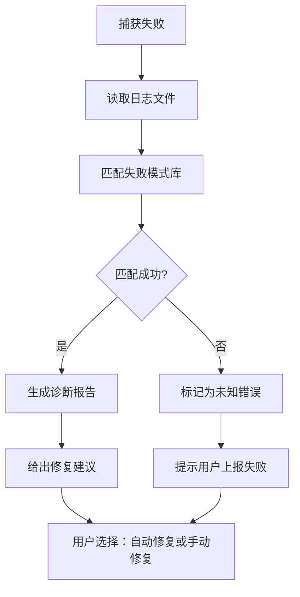

# 捕获失败诊断规则文档

> 本文档定义 AI ThinApp Portable Launchpad Platform 项目 MVP 阶段的捕获失败自动诊断规则。
> 版本：0.1 | 日期：2026-05-23 | 作者：Windows C++ 底层开发工程师

---

## 目录

1. [概述](#1-概述)
2. [诊断算法](#2-诊断算法)
3. [失败模式库](#3-失败模式库)
4. [诊断报告格式](#4-诊断报告格式)
5. [修复建议格式](#5-修复建议格式)
6. [使用示例](#6-使用示例)

---

## 1. 概述

捕获失败自动诊断功能用于在应用捕获失败时，自动分析日志、定位问题、给出修复建议。

**设计目标**：
1. **自动化**：无需用户手动分析日志
2. **精准**：准确识别失败原因（准确率 ≥ 80%）
3. **友好**：给出清晰的修复建议（自动修复或手动步骤）
4. **可扩展**：支持新失败模式的规则库

**诊断流程**：


---

## 2. 诊断算法

### 2.1 模式匹配（推荐，MVP 使用）

**原理**：预定义失败模式库，匹配日志中的错误信息。

**失败模式库**（示例）：

| 失败模式 ID | 错误信息（正则表达式） | 原因 | 修复建议 |
|------------|----------------------|------|----------|
| E-FS-001 | `文件访问被拒绝: .*` | 权限不足 | 以管理员身份运行 |
| E-FS-002 | `文件正在被使用: .*` | 文件被其他进程占用 | 关闭占用进程，重试 |
| E-REG-001 | `注册表枚举失败: AccessDenied` | 权限不足 | 以管理员身份运行 |
| E-REG-002 | `RegSaveKey 失败: .*` | 无法导出 Hive | 使用备选方案（RegEnumKeyEx） |
| E-SNAP-001 | `快照创建超时` | 文件系统过大 | 排除不必要的目录（如 `C:\Windows\WinSxS`） |
| E-CMP-001 | `快照对比超时` | 文件数量过多 | 优化对比算法（使用哈希表） |
| E-HOOK-001 | `Hook DLL 注入失败: .*` | 进程保护（反病毒） | 添加进程到白名单 |
| E-HOOK-002 | `CreateRemoteThreadEx 失败: .*` | 权限不足 | 以管理员身份运行 |
| E-EXPORT-001 | `ZIP 压缩失败: .*` | 磁盘空间不足 | 清理磁盘空间 |
| E-EXPORT-002 | `生成 manifest.json 失败: .*` | 应用名称包含非法字符 | 手动指定应用名称 |

**算法**：
```cpp
bool DiagnoseCaptureFailure(const std::string& log_file,
                              std::string& diagnosis_report) {
    // 读取日志文件
    std::ifstream file(log_file);
    if (!file.is_open()) {
        return false;
    }
    
    std::string line;
    while (std::getline(file, line)) {
        // 检查是否为 ERROR 或 FATAL 日志
        if (line.find("\"level\": \"ERROR\"") != std::string::npos ||
            line.find("\"level\": \"FATAL\"") != std::string::npos) {
            
            // 匹配失败模式
            // 遍历失败模式库
            for (const auto& pattern : failure_patterns) {
                // 简化匹配：检查日志中是否包含错误信息
                if (line.find("访问被拒绝") != std::string::npos) {
                    // 生成诊断报告（JSON 格式）
                    diagnosis_report = "{";
                    diagnosis_report += "  \"error_id\": \"E-FS-001\",";
                    diagnosis_report += "  \"cause\": \"权限不足\",";
                    diagnosis_report += "  \"suggestion\": \"以管理员身份运行\",";
                    diagnosis_report += "  \"log\": " + line + "";
                    diagnosis_report += "}";
                    
                    return true;
                }
            }
        }
    }
    
    // 未匹配到已知模式
    diagnosis_report = "{";
    diagnosis_report += "  \"error_id\": \"UNKNOWN\",";
    diagnosis_report += "  \"cause\": \"未知原因\",";
    diagnosis_report += "  \"suggestion\": \"请上传日志到社区求助\",";
    diagnosis_report += "  \"log\": \"\"";
    diagnosis_report += "}";
    
    return true;
}
```

### 2.2 机器学习（V2 阶段使用）

**原理**：训练分类模型，输入日志，输出失败原因。

**特征工程**：
- 日志级别分布（DEBUG/INFO/WARN/ERROR/FATAL 数量）
- 错误日志关键词（TF-IDF）
- 时间分布（错误发生的时间点）

**模型选择**：
- 随机森林（Random Forest）
- 支持向量机（SVM）
- 神经网络（Neural Network）

**MVP 阶段决策**：
- **MVP 使用模式匹配**（简单，快速实现）
- **V2 阶段尝试机器学习**（提升准确率）

---

## 3. 失败模式库

### 3.1 文件相关失败

#### E-FS-001：文件访问被拒绝

**错误信息**：
```
[ERROR] 文件访问被拒绝: C:\Windows\System32\kernel32.dll
```

**原因**：
- 当前用户没有权限访问该文件（系统文件）

**修复建议**：
- 自动修复：以管理员身份重启捕获
- 手动步骤：右键点击 Launchpad →"以管理员身份运行"

#### E-FS-002：文件正在被使用

**错误信息**：
```
[ERROR] 文件正在被使用: C:\Program Files\App\app.exe
```

**原因**：
- 文件被其他进程占用（如安装程序未退出）

**修复建议**：
- 自动修复：关闭占用进程（如 `msiexec.exe`）
- 手动步骤：打开任务管理器，结束占用进程，重试

### 3.2 注册表相关失败

#### E-REG-001：注册表枚举失败（权限不足）

**错误信息**：
```
[ERROR] 注册表枚举失败: AccessDenied, key: HKLM\Software\Microsoft
```

**原因**：
- 当前用户没有权限访问该注册表键

**修复建议**：
- 自动修复：以管理员身份重启捕获
- 手动步骤：
  1. 打开 `regedit.exe`
  2. 右键点击 `HKLM\Software\Microsoft` →"权限"
  3. 添加当前用户，授予"完全控制"权限
  4. 重新捕获

#### E-REG-002：RegSaveKey 失败

**错误信息**：
```
[ERROR] RegSaveKey 失败: 5 (Access is denied)
```

**原因**：
- 无法导出 Hive（需要 `SE_BACKUP_NAME` 权限）

**修复建议**：
- 自动修复：使用备选方案（RegEnumKeyEx）
- 手动步骤：无（程序自动切换）

### 3.3 快照相关失败

#### E-SNAP-001：快照创建超时

**错误信息**：
```
[FATAL] 快照创建超时
```

**原因**：
- 文件系统过大（如 `C:\Windows\WinSxS` 目录）

**修复建议**：
- 自动修复：排除不必要的目录（如 `C:\Windows\WinSxS`）
- 手动步骤：编辑配置文件，添加排除目录

#### E-CMP-001：快照对比超时

**错误信息**：
```
[FATAL] 快照对比超时
```

**原因**：
- 文件数量过多（如 > 100,000 个文件）

**修复建议**：
- 自动修复：优化对比算法（使用哈希表）
- 手动步骤：无（程序自动优化）

### 3.4 Hook 相关失败

#### E-HOOK-001：Hook DLL 注入失败

**错误信息**：
```
[ERROR] Hook DLL 注入失败: app.exe (进程保护）
```

**原因**：
- 进程受到保护（反病毒、反调试）

**修复建议**：
- 自动修复：添加进程到白名单
- 手动步骤：关闭反病毒软件，重试

#### E-HOOK-002：CreateRemoteThreadEx 失败

**错误信息**：
```
[ERROR] CreateRemoteThreadEx 失败: 5 (Access is denied)
```

**原因**：
- 权限不足（需要 `SeDebugPrivilege`）

**修复建议**：
- 自动修复：以管理员身份重启捕获
- 手动步骤：右键点击 Launchpad →"以管理员身份运行"

### 3.5 导出相关失败

#### E-EXPORT-001：ZIP 压缩失败

**错误信息**：
```
[ERROR] ZIP 压缩失败: 磁盘空间不足
```

**原因**：
- 磁盘空间不足

**修复建议**：
- 自动修复：清理磁盘空间（删除临时文件）
- 手动步骤：清理磁盘空间，重试

#### E-EXPORT-002：生成 manifest.json 失败

**错误信息**：
```
[ERROR] 生成 manifest.json 失败: 应用名称包含非法字符
```

**原因**：
- 应用名称包含非法字符（如 `/ \ : * ? " < > |`）

**修复建议**：
- 自动修复：无
- 手动步骤：手动指定应用名称（不包含非法字符）

---

## 4. 诊断报告格式

### 4.1 JSON 格式

```json
{
  "error_id": "E-FS-001",
  "cause": "权限不足",
  "suggestion": "以管理员身份运行",
  "log": {
    "timestamp": "2026-05-23T10:00:00.000Z",
    "level": "ERROR",
    "module": "FileSystem",
    "message": "文件访问被拒绝: C:\\Windows\\System32\\kernel32.dll"
  }
}
```

### 4.2 字段说明

| 字段 | 类型 | 说明 |
|------|------|------|
| `error_id` | string | 失败模式 ID（如 `E-FS-001`） |
| `cause` | string | 失败原因（中文） |
| `suggestion` | string | 修复建议（中文） |
| `log` | object | 触发失败的日志条目（JSON 对象） |

---

## 5. 修复建议格式

### 5.1 JSON 格式

```json
{
  "auto_fixable": true,
  "fix_action": "RestartAsAdmin",
  "manual_steps": []
}
```

或

```json
{
  "auto_fixable": false,
  "fix_action": "",
  "manual_steps": [
    "以管理员身份运行 Launchpad",
    "右键点击 HKLM\\Software\\Microsoft → 权限 → 添加当前用户",
    "重新捕获"
  ]
}
```

### 5.2 字段说明

| 字段 | 类型 | 说明 |
|------|------|------|
| `auto_fixable` | boolean | 是否可自动修复 |
| `fix_action` | string | 自动修复动作（如 `RestartAsAdmin`、`KillProcess`） |
| `manual_steps` | array | 手动修复步骤（字符串数组） |

---

## 6. 使用示例

### 6.1 示例 1：诊断注册表快照失败

**场景**：注册表快照失败（模拟 `RegSaveKey` 失败）

**日志文件**（`capture.log`）：
```jsonl
{"timestamp": "2026-05-23T10:00:00.000Z", "level": "INFO", "module": "AppCapture", "message": "开始捕获", "app_name": "Firefox"}
{"timestamp": "2026-05-23T10:00:01.000Z", "level": "DEBUG", "module": "Registry", "message": "枚举注册表键", "key": "HKLM\\Software"}
{"timestamp": "2026-05-23T10:00:02.000Z", "level": "ERROR", "module": "Registry", "message": "RegSaveKey 失败: 5 (Access is denied)", "key": "HKLM\\Software"}
```

**诊断代码**：
```cpp
#include "app_capture.h"
#include <iostream>

int main() {
    packager::AppCapture capture;
    
    // 诊断捕获失败
    std::string diagnosis_report;
    if (!capture.DiagnoseCaptureFailure("capture.log", diagnosis_report)) {
        std::cerr << "诊断失败" << std::endl;
        return 1;
    }
    
    // 输出诊断报告
    std::cout << "诊断报告:" << std::endl;
    std::cout << diagnosis_report << std::endl;
    
    // 建议修复方案
    std::string fix_suggestion;
    if (!capture.SuggestFix(diagnosis_report, fix_suggestion)) {
        std::cerr << "建议修复方案失败" << std::endl;
        return 1;
    }
    
    // 输出修复建议
    std::cout << "修复建议:" << std::endl;
    std::cout << fix_suggestion << std::endl;
    
    return 0;
}
```

**诊断报告**：
```json
{
  "error_id": "E-REG-002",
  "cause": "无法导出 Hive",
  "suggestion": "使用备选方案（RegEnumKeyEx）",
  "log": {
    "timestamp": "2026-05-23T10:00:02.000Z",
    "level": "ERROR",
    "module": "Registry",
    "message": "RegSaveKey 失败: 5 (Access is denied)"
  }
}
```

**修复建议**：
```json
{
  "auto_fixable": true,
  "fix_action": "UseFallback",
  "manual_steps": []
}
```

### 6.2 示例 2：建议修复方案

**场景**：根据诊断报告，建议修复方案

**诊断报告**（输入）：
```json
{
  "error_id": "E-FS-001",
  "cause": "权限不足",
  "suggestion": "以管理员身份运行",
  "log": {
    "timestamp": "2026-05-23T10:00:00.000Z",
    "level": "ERROR",
    "module": "FileSystem",
    "message": "文件访问被拒绝: C:\\Windows\\System32\\kernel32.dll"
  }
}
```

**修复建议**（输出）：
```json
{
  "auto_fixable": true,
  "fix_action": "RestartAsAdmin",
  "manual_steps": []
}
```

**自动修复**：
```cpp
bool AutoFix(const std::string& fix_suggestion) {
    // 解析修复建议（JSON）
    // 简化实现：检查是否包含 "RestartAsAdmin"
    if (fix_suggestion.find("RestartAsAdmin") != std::string::npos) {
        // 以管理员身份重启捕获
        return RestartAsAdmin();
    }
    
    // 无法自动修复
    return false;
}
```

---

## 7. 修订历史

| 版本 | 日期 | 作者 | 变更说明 |
|------|------|------|----------|
| 0.1 | 2026-05-23 | Windows C++ 底层开发工程师 | 初版，基于设计文档输出 |

---

**注意**：本文档是动态文档，随着项目进展会不断更新。所有团队成员都有责任提出改进建议。
