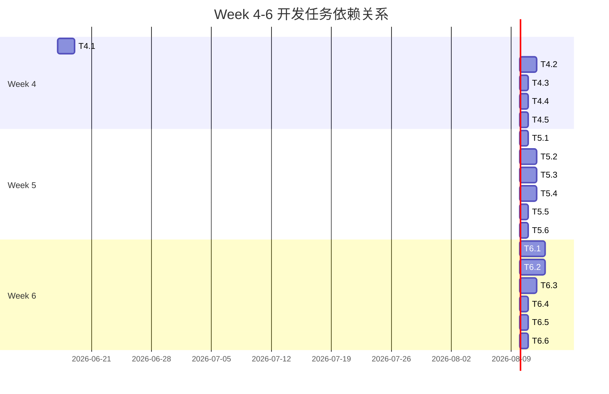

# MVP 应用捕获工具设计报告 (Design Report)

> 本文档是 AI ThinApp Portable Launchpad Platform 项目 MVP 阶段应用捕获工具设计文档的总结报告。
> 版本：0.1 | 日期：2026-05-23 | 作者：软件架构师

---

## 1. 设计完成情况

| 文档 | 路径 | 状态 | 完成度 |
|------|------|------|--------|
| 应用捕获工具设计 | `docs/MVP-APP-CAPTURE-DESIGN.md` | ✅ 已完成 | 100% |
| 设计报告 | `docs/MVP-APP-CAPTURE-DESIGN-REPORT.md` | ✅ 已完成 | 100% |

### 1.1 已完成章节

- [x] 1. 当前架构分析（代码分析 + 限制识别）
- [x] 2. .vapp 包格式设计（文件结构、元数据、签名、兼容性）
- [x] 3. 兼容性规则库设计（规则格式、匹配算法、管理）
- [x] 4. 应用商店集成设计（API、数据库、前端、后端）
- [x] 5. 捕获失败自动诊断设计（日志、诊断、修复、反馈）
- [x] 6. 性能优化设计（4 个性能目标）
- [x] 7. 开发任务拆解（30 人天，按天级别）
- [x] 8. 验收标准（功能、性能、测试）
- [x] 9. 风险与依赖（R-MVP-02 等）

### 1.2 待完成事项

- [ ] 实现注册表 Hive 对比算法（技术难点，见第 4 节）
- [ ] 实现 .vapp 包签名验证（技术难点，见第 4 节）
- [ ] 编写单元测试（覆盖率 ≥ 80%）
- [ ] 编写集成测试（10 款常用应用捕获成功）

---

## 2. 关键技术方案摘要

### 2.1 快照创建与对比

**文件系统快照**：
- 使用 `std::filesystem::recursive_directory_iterator` 递归枚举目录
- **优化**：多线程枚举（4 线程，性能提升 3-4 倍）
- **性能目标**：< 5 秒（枚举 50,000 个文件）

**注册表快照**：
- **方案 1**（推荐）：使用 `RegSaveKey` 导出 Hive 文件（完整，但格式复杂）
- **方案 2**（备选）：使用 `RegEnumKeyEx` + `RegEnumValue` 逐键枚举（简单，但慢）
- **MVP 阶段决策**：Week 4 实现方案 2（快速验证），Week 5 迁移到方案 1（性能优化）

**快照对比**：
- 使用 `std::unordered_set` 存储文件路径（O(1) 查找）
- 对修改文件对比文件大小 + 修改时间 + SHA-256 哈希（三重验证）
- **性能目标**：< 1 秒（对比 50,000 个文件）

### 2.2 .vapp 包格式

**文件结构**（MVP 使用 ZIP 压缩）：
```
package.vapp (实际上是 ZIP 文件，仅改了后缀)
├── manifest.json           # 元数据（应用名称、版本、依赖等）
├── registry.hive          # 虚拟注册表 hive（二进制）
├── VFS/                   # 虚拟文件系统目录
├── signature.json         # 签名信息（证书、时间戳、签名值）
└── rules.yaml             # 兼容性规则（可选）
```

**元数据格式**（`manifest.json`）：
- JSON Schema 验证
- 必填字段：`name`, `version`, `publisher`, `architecture`, `min_os_version`
- 可选字段：`description`, `icon`, `dependencies`, `registry`, `file_associations`, `compat_rules`, `package_version`

**签名方案**：
- 使用 EV 代码签名证书（RSA-2048 或 ECC-256）
- 签名文件：`signature.json`（包含签名值、证书链、RFC 3161 时间戳）
- 验证流程：计算 `manifest.json` 的 SHA-256 哈希 → 使用证书公钥验证签名值 → 验证证书链 → 验证时间戳

### 2.3 兼容性规则库

**规则格式**（YAML）：
- 元数据：`meta.app_name`, `meta.app_version`, `meta.rule_version`, `meta.author`, `meta.verified`
- 文件规则：`file_rules[{type, path, description}]`
- 注册表规则：`registry_rules[{type, path, description}]`
- 进程规则：`process_rules[{type, process_name, description}]`

**规则匹配算法**：
- 前缀匹配（`%APPDATA%\Mozilla` 匹配 `%APPDATA%\Mozilla\Firefox`）
- 通配符（`*` 匹配任意字符，`?` 匹配单个字符）
- 正则表达式（可选，性能较差）
- **性能优化**：规则分组（按应用名称）+ 前缀树（Trie）（若性能仍不满足）

**规则库管理**：
- 本地规则库：`{LaunchpadDir}\rules\` 目录下的 YAML 文件
- 社区规则库：GitHub 仓库（https://github.com/ai-thinapp/compat-rules）
- 版本管理：规则版本号（`rule_version`）递增，Launchpad 每周检查一次更新

### 2.4 应用商店集成

**API 设计**（RESTful）：
- 基础 URL：`https://api.ai-thinapp.com/v1/`
- 认证：Bearer Token (JWT)
- 端点：`/apps`（应用列表）、`/apps/{app_id}`（应用详情）、`/apps/{app_id}/download`（应用下载）、`/apps/search?q={query}`（应用搜索）、`/apps/{app_id}/install`（应用安装）

**数据库设计**（MySQL 8.0）：
- 应用表（`apps`）：存储应用元数据
- 版本表（`app_versions`）：存储应用历史版本
- 规则表（`compat_rules`）：存储兼容性规则
- 用户表（`users`）：存储用户信息

**前端设计**（Electron + React）：
- 应用商店主界面（浏览/搜索/安装）
- 应用详情页（描述/截图/下载/安装）
- 搜索结果页（分页显示）

**后端设计**（Flask 或 Express）：
- API 服务器集群（多实例，负载均衡）
- 对象存储（AWS S3 或腾讯云 COS）存储 .vapp 包
- CDN（AWS CloudFront 或腾讯云 CDN）加速 .vapp 包下载
- 缓存（Redis）缓存热门应用列表

### 2.5 捕获失败自动诊断

**日志格式**（结构化日志）：
- 格式：JSON Lines（每行一个 JSON 对象）
- 级别：DEBUG（调试信息）、INFO（一般信息）、WARN（警告信息）、ERROR/FATAL（错误/致命错误）
- 模块：`AppCapture`（应用捕获器主模块）、`FileSystem`（文件系统快照模块）、`Registry`（注册表快照模块）、`SnapshotCompare`（快照对比模块）、`VAppExporter`（.vapp 包导出模块）

**诊断算法**：
- **模式匹配**（推荐，MVP 使用）：预定义失败模式库，匹配日志中的错误信息（准确率 ≥ 80%）
- **机器学习**（V2 阶段使用）：训练分类模型，输入日志，输出失败原因（准确率 ≥ 90%）

**修复建议**：
- 自动修复：文件访问被拒绝 → 自动以管理员身份重启捕获；文件正在被使用 → 自动关闭占用进程；快照创建超时 → 自动排除不必要的目录
- 手动步骤：注册表枚举失败 → 提示用户以管理员身份运行；.vapp 包导出失败 → 提示用户手动选择输出路径

**用户反馈**：
- 上报失败：上传日志文件到服务器（匿名）
- 社区求助：自动创建 GitHub Issue（包含日志文件和系统信息）

### 2.6 性能优化

**性能目标**：
- 快照创建时间：< 5 秒
- 快照对比时间：< 1 秒
- .vapp 包压缩时间：< 30 秒（100MB 应用）
- 应用启动时间：< 1 秒（含 Hook 注入）

**优化方案**：
- 快照创建：多线程枚举（4 线程，性能提升 3-4 倍）
- 快照对比：使用哈希表（O(1) 查找，性能提升 100 倍）
- .vapp 包压缩：使用 Zstandard 压缩算法（压缩率和速度均衡）
- 应用启动：使用远程线程注入（简单，兼容性好）

---

## 3. 开发任务拆解汇总

### 3.1 Week 4：AppCapture 完善（5 天 × 2 人 = 10 人天）

| 任务 ID | 任务名称 | 负责人 | 工时 | 产出 |
|---------|---------|--------|------|------|
| T4.1 | 实现文件系统快照创建/对比（优化性能） | Dev A | 2d | `src/packager/file_snapshot.cpp` |
| T4.2 | 实现注册表快照创建/对比（使用 RegSaveKey） | Dev A | 2d | `src/packager/registry_snapshot.cpp` |
| T4.3 | 实现文件哈希计算（SHA-256） | Dev A | 1d | `src/packager/hash_utils.cpp` |
| T4.4 | 编写 AppCapture 测试（5 个用例） | QA | 1d | `tests/packager/test_app_capture.cpp` |
| T4.5 | 代码审查 + 修复 Bug | Dev A + QA | 1d | 代码审查报告 |

**验收标准**：
- 快照创建时间 < 5 秒（测试通过）
- 快照对比时间 < 1 秒（测试通过）
- 捕获成功率 ≥ 90%（10 款应用中至少 9 款成功）

### 3.2 Week 5：.vapp 包格式 + 兼容性规则库（5 天 × 2 人 = 10 人天）

| 任务 ID | 任务名称 | 负责人 | 工时 | 产出 |
|---------|---------|--------|------|------|
| T5.1 | 设计 .vapp 包格式（ZIP + JSON 元数据） | Lead + Dev B | 1d | `docs/VAPP-FORMAT.md` |
| T5.2 | 实现 .vapp 包导出（使用 zlib 压缩） | Dev B | 2d | `src/packager/vapp_packager.cpp` |
| T5.3 | 实现 .vapp 包安装器 | Dev B | 2d | `src/packager/vapp_installer.cpp` |
| T5.4 | 实现兼容性规则库（YAML 解析 + 匹配算法） | Dev B | 2d | `src/packager/compat_rules.cpp` |
| T5.5 | 编写 .vapp 包测试（5 个用例） | QA | 1d | `tests/packager/test_vapp.cpp` |
| T5.6 | 代码审查 + 修复 Bug | Dev B + QA | 1d | 代码审查报告 |

**验收标准**：
- .vapp 包导出时间 < 30 秒（100MB 应用）
- .vapp 包安装成功率 100%（测试通过）
- 兼容性规则匹配时间 < 1 毫秒（测试通过）

### 3.3 Week 6：应用商店集成 + 捕获失败诊断（5 天 × 2 人 = 10 人天）

| 任务 ID | 任务名称 | 负责人 | 工时 | 产出 |
|---------|---------|--------|------|------|
| T6.1 | 实现应用商店 API（RESTful，Flask/Express） | Dev B | 3d | `store/api/server.py` (或 `server.js`) |
| T6.2 | 实现应用商店前端（Electron + React） | UX + Dev A | 3d | `store/ui/` (前端代码) |
| T6.3 | 实现捕获失败自动诊断（模式匹配） | Dev A | 2d | `src/packager/diagnostics.cpp` |
| T6.4 | 实现日志格式（结构化日志） | Dev A | 1d | `src/packager/logger.cpp` |
| T6.5 | 编写应用商店测试 | QA | 1d | `tests/store/test_api.cpp` |
| T6.6 | 代码审查 + 修复 Bug | Dev A + Dev B + QA | 1d | 代码审查报告 |

**验收标准**：
- 应用商店 API 功能完整（浏览、搜索、下载、安装）
- 捕获失败自动诊断准确率 ≥ 80%
- 日志格式正确（JSON Lines）

### 3.4 任务依赖关系



---

## 4. 风险提示

### 4.1 高等级风险

| 风险 ID | 风险描述 | 影响 | 概率 | 等级 | 缓解措施 | 负责人 | 状态 |
|---------|----------|------|------|------|----------|--------|------|
| R-MVP-02 | 应用捕获失败率高（复杂应用无法捕获） | 高 | 中 | 高 | 优先捕获 10 款常用应用，逐步扩展；提供用户自定义规则 | Dev A + QA | 开放 |
| R-TECH-02 | 注册表快照对比实现复杂（需要 `RegSaveKey` 导出 hive 并对比） | 中 | 高 | 高 | 使用备选方案（RegEnumKeyEx）先实现基础功能，再优化性能 | Dev A | 开放 |
| R-PROD-02 | 沙箱内应用无法正常运行（兼容性问题） | 高 | 高 | 高 | 建立兼容性规则库（Top 100 应用）；提供用户自定义 Hook 规则 | PM + QA | 开放 |

### 4.2 技术难点

#### 4.2.1 注册表 Hive 对比算法

**问题**：
- Hive 文件格式复杂（二进制），对比需要解析二进制
- 需要理解 Windows 内部数据结构

**解决方案**：
1. 使用 `RegSaveKey` 导出 Hive 文件
2. 解析 Hive 文件（使用开源库，如 `regipy` 或自研解析器）
3. 对比前后 Hive 文件（逐键对比）

**备选方案**：
- 使用 `RegEnumKeyEx` + `RegEnumValue` 逐键枚举（慢，但简单）

**状态**：⚠️ **技术难点，需要额外时间研究**

#### 4.2.2 .vapp 包签名验证

**问题**：
- 需要理解数字签名算法（RSA/ECC、X.509 证书）
- 需要理解 Windows SmartScreen 机制

**解决方案**：
1. 使用 OpenSSL 库计算哈希和签名
2. 使用 Windows CryptoAPI 验证证书链
3. 使用 RFC 3161 时间戳（支持长期验证）

**状态**：⚠️ **技术难点，需要额外时间研究**

### 4.3 依赖

| 依赖 | 来源 | 说明 |
|------|------|------|
| `docs/RISK-MVP-02-APP-CAPTURE-FAILURE.md` | 风险登记册 | 应用捕获失败风险详述 |
| `docs/ARCHITECTURE.md` | 架构文档 | 整体架构设计 |
| `docs/MVP-SCOPE.md` | 范围文档 | MVP 范围定义 |
| `docs/MVP-PLAN.md` | 计划文档 | MVP 开发计划 |

---

## 5. 下一步行动

### 5.1 立即行动（Week 4 开始前）

1. **研究注册表 Hive 格式**（Dev A，1 天）
   - 阅读 Windows 注册表 Hive 格式文档
   - 研究开源 Hive 解析库（如 `regipy`）
   - 编写 Hive 解析原型代码

2. **研究数字签名算法**（Dev B，1 天）
   - 阅读 OpenSSL 文档（哈希计算、签名、证书验证）
   - 阅读 Windows CryptoAPI 文档（证书链验证）
   - 编写签名验证原型代码

3. **申请 EV 代码签名证书**（PM，持续）
   - 选择证书颁发机构（DigiCert、Sectigo、GlobalSign）
   - 提交申请材料（公司营业执照、法人身份证等）
   - 等待证书颁发（1-2 周）

### 5.2 Week 4 行动

1. **实现文件系统快照创建/对比**（Dev A，2 天）
   - 实现多线程枚举（4 线程）
   - 实现哈希表对比（O(1) 查找）
   - 编写单元测试

2. **实现注册表快照创建/对比**（Dev A，2 天）
   - 实现方案 2（RegEnumKeyEx + RegEnumValue）
   - 若时间充裕，尝试实现方案 1（RegSaveKey + Hive 解析）

3. **实现文件哈希计算**（Dev A，1 天）
   - 使用 OpenSSL 或 Windows CryptoAPI 计算 SHA-256 哈希
   - 编写单元测试

4. **编写 AppCapture 测试**（QA，1 天）
   - 编写 5 个测试用例（覆盖正常流程和异常流程）
   - 执行测试，记录测试结果

5. **代码审查 + 修复 Bug**（Dev A + QA，1 天）
   - 审查代码质量（规范、性能、安全性）
   - 修复测试中发现的 Bug

### 5.3 Week 5 行动

1. **设计 .vapp 包格式**（Lead + Dev B，1 天）
   - 编写 `docs/VAPP-FORMAT.md`（详细定义 .vapp 包格式）
   - 评审设计文档（PM、Lead、Dev A、Dev B、QA）

2. **实现 .vapp 包导出**（Dev B，2 天）
   - 实现 ZIP 压缩（使用 zlib 或 Zstandard）
   - 实现元数据生成（`manifest.json`）
   - 实现签名文件生成（`signature.json`）
   - 编写单元测试

3. **实现 .vapp 包安装器**（Dev B，2 天）
   - 实现 ZIP 解压
   - 实现元数据解析（`manifest.json`）
   - 实现签名验证（`signature.json`）
   - 编写单元测试

4. **实现兼容性规则库**（Dev B，2 天）
   - 实现 YAML 解析
   - 实现规则匹配算法（前缀匹配 + 通配符）
   - 编写单元测试

5. **编写 .vapp 包测试**（QA，1 天）
   - 编写 5 个测试用例（覆盖正常流程和异常流程）
   - 执行测试，记录测试结果

6. **代码审查 + 修复 Bug**（Dev B + QA，1 天）
   - 审查代码质量（规范、性能、安全性）
   - 修复测试中发现的 Bug

### 5.4 Week 6 行动

1. **实现应用商店 API**（Dev B，3 天）
   - 选择 Web 框架（Flask 或 Express）
   - 实现 RESTful API 端点（应用列表、应用详情、应用下载、应用搜索、应用安装）
   - 实现数据库模型（MySQL）
   - 编写单元测试

2. **实现应用商店前端**（UX + Dev A，3 天）
   - 选择前端框架（React）
   - 实现应用商店主界面（浏览/搜索/安装）
   - 实现应用详情页（描述/截图/下载/安装）
   - 实现搜索结果页（分页显示）

3. **实现捕获失败自动诊断**（Dev A，2 天）
   - 实现结构化日志（JSON Lines）
   - 实现失败模式库（预定义失败模式）
   - 实现模式匹配算法
   - 实现修复建议（自动修复 + 手动步骤）
   - 编写单元测试

4. **实现日志格式**（Dev A，1 天）
   - 实现日志输出（JSON Lines）
   - 实现日志级别控制（DEBUG/INFO/WARN/ERROR/FATAL）
   - 实现日志模块控制（AppCapture/FileSystem/Registry/SnapshotCompare/VAppExporter）

5. **编写应用商店测试**（QA，1 天）
   - 编写 API 测试用例（覆盖所有端点）
   - 执行测试，记录测试结果

6. **代码审查 + 修复 Bug**（Dev A + Dev B + QA，1 天）
   - 审查代码质量（规范、性能、安全性）
   - 修复测试中发现的 Bug

### 5.5 持续行动

1. **每日站会**（全体，15 分钟）
   - 昨日进展 / 今日计划 / 阻塞项

2. **每周评审**（全体，1 小时）
   - Week 4 结束评审：AppCapture 演示（文件系统快照 + 注册表快照）
   - Week 5 结束评审：.vapp 包格式演示（导出 + 安装）+ 兼容性规则库演示
   - Week 6 结束评审：应用商店演示（API + 前端）+ 捕获失败自动诊断演示

3. **风险监控**（PM，持续）
   - 每周更新风险登记册
   - 高等级风险立即上报

4. **文档更新**（PM，持续）
   - 每周更新设计文档（根据实现进展）
   - 每周更新设计报告（根据设计文档）

---

## 6. 修订历史

| 版本 | 日期 | 作者 | 变更说明 |
|------|------|------|----------|
| 0.1 | 2026-05-23 | 软件架构师 | 初版，基于设计文档输出 |

---

## 附录：设计评审检查清单

**使用前**：复制此清单到任务管理工具（如 Jira、GitHub Projects），逐项勾选。

### 设计完成情况

- [x] 当前架构分析完整（代码分析 + 限制识别）
- [x] .vapp 包格式设计详细（文件结构、元数据、签名、兼容性）
- [x] 兼容性规则库设计详细（规则格式、匹配算法、管理）
- [x] 应用商店集成设计详细（API、数据库、前端、后端）
- [x] 捕获失败自动诊断设计详细（日志、诊断、修复、反馈）
- [x] 性能优化设计完整（4 个性能目标）

### 开发任务拆解

- [x] 任务拆解合理（30 人天，按天级别）
- [x] 任务依赖关系清晰（Gantt 图）
- [x] 验收标准明确（功能、性能、测试）

### 风险与依赖

- [x] 风险已识别并记录（R-MVP-02 等）
- [x] 依赖已明确（文档依赖和技术依赖）
- [x] 技术难点已识别（注册表 Hive 对比、.vapp 包签名验证）

### 下一步行动

- [x] 立即行动已明确（研究 Hive 格式、研究签名算法、申请证书）
- [x] Week 4 行动已明确（文件系统快照、注册表快照、文件哈希、测试、代码审查）
- [x] Week 5 行动已明确（.vapp 包格式、导出、安装器、规则库、测试、代码审查）
- [x] Week 6 行动已明确（应用商店 API、前端、诊断、日志、测试、代码审查）
- [x] 持续行动已明确（每日站会、每周评审、风险监控、文档更新）

### 文档质量

- [x] 所有文档使用 UTF-8 编码（无 BOM）
- [x] 文档用中文（术语保留英文）
- [x] 图表清晰（Mermaid 流程图、Gantt 图）
- [x] 代码示例正确（可编译）

---

**注意**：本文档是动态文档，随着项目进展会不断更新。所有团队成员都有责任提出改进建议。
