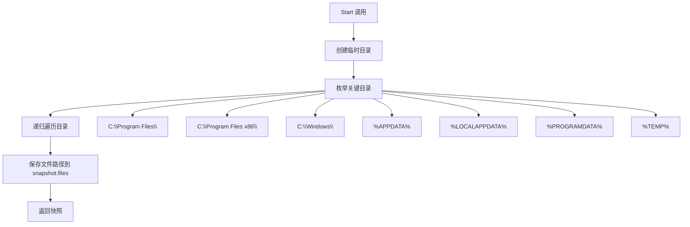
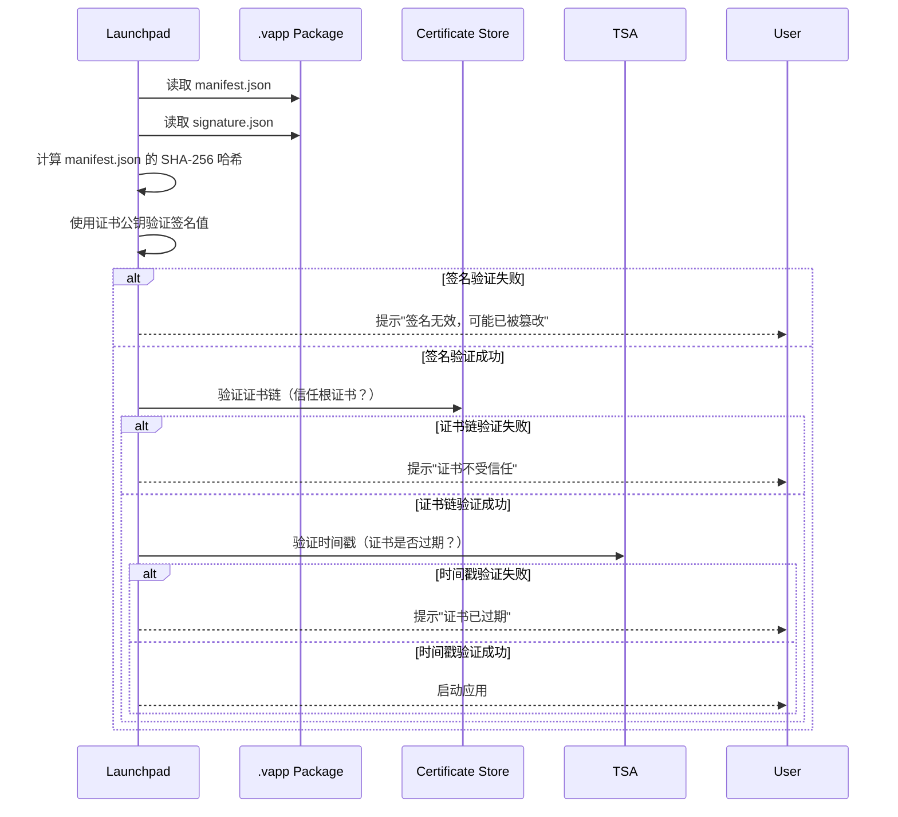
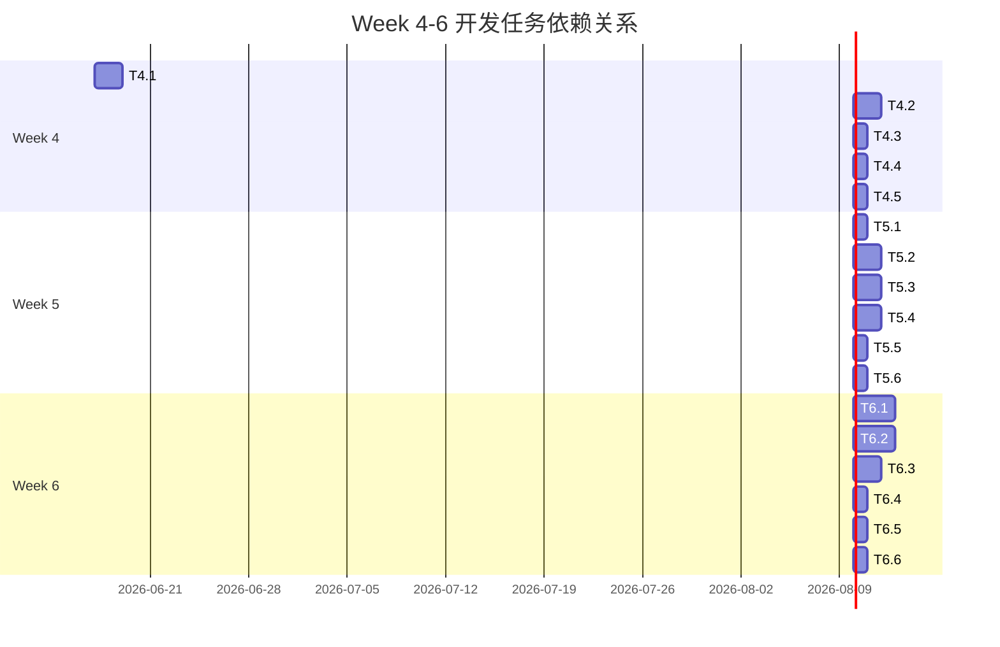

# MVP 应用捕获工具设计文档 (AppCapture Design)

> 本文档定义 AI ThinApp Portable Launchpad Platform 项目 MVP 阶段（Week 4-6）应用捕获工具的详细设计。
> 版本：0.1 | 日期：2026-05-23 | 作者：软件架构师

---

## 目录

1. [当前架构分析](#1-当前架构分析)
2. [.vapp 包格式设计](#2-vapp-包格式设计)
3. [兼容性规则库设计](#3-兼容性规则库设计)
4. [应用商店集成设计](#4-应用商店集成设计)
5. [捕获失败自动诊断设计](#5-捕获失败自动诊断设计)
6. [性能优化设计](#6-性能优化设计)
7. [开发任务拆解](#7-开发任务拆解)
8. [验收标准](#8-验收标准)
9. [风险与依赖](#9-风险与依赖)

---

## 1. 当前架构分析

### 1.1 概述

应用捕获工具（AppCapture）是 Packager 模块的核心组件，用于监控应用安装过程，捕获所有文件/注册表操作，生成 .vapp 包。

**当前实现状态**（基于 `src/packager/app_capture.cpp` 分析）：
- POC 阶段原型已完成
- 实现了基础的文件系统快照创建和对比
- 注册表快照功能为桩函数（未实现）
- .vapp 包导出功能为桩函数（未实现）

### 1.2 快照创建流程

#### 1.2.1 当前实现（文件系统）



**代码分析**（`AppCapture::CreateSnapshot`）：
```cpp
// 关键目录列表
std::vector<std::string> directories = {
    "C:\\Program Files\\",
    "C:\\Program Files (x86)\\",
    "C:\\Windows\\",
    GetEnv("APPDATA"),
    GetEnv("LOCALAPPDATA"),
    GetEnv("PROGRAMDATA"),
    GetEnv("TEMP")
};

// 枚举每个目录
for (const auto& dir : directories) {
    EnumFiles(dir, snapshot.files);
}
```

**限制**：
1. 硬编码目录列表，不支持用户自定义
2. 未过滤临时文件和缓存文件（如 `C:\Windows\Temp\*`）
3. 未记录文件元数据（大小、修改时间、哈希），导致对比不准确

#### 1.2.2 注册表快照（POC 阶段未实现）

**当前状态**：`AppCapture::EnumRegKeys` 为桩函数，仅打印提示信息。

**需要实现**：
1. 使用 `RegSaveKey` API 导出 HKLM\Software 和 HKCU\Software 为 hive 文件
2. 解析 hive 文件（二进制格式），提取所有键和值
3. 保存注册表路径和值到 `snapshot.regKeys`

**技术难点**：
- Hive 文件格式复杂（二进制），解析需要理解 Windows 内部数据结构
- 备选方案：使用 `RegEnumKeyEx` + `RegEnumValue` 逐键枚举（慢，但简单）

### 1.3 快照对比算法

#### 1.3.1 当前实现（仅路径对比）

```cpp
// 找出新增/修改的文件
for (const auto& file : after.files) {
    auto it = std::find(before.files.begin(), before.files.end(), file);
    
    if (it == before.files.end()) {
        // 新增文件
        CaptureRecord record;
        record.type = CaptureEvent::FileCreated;
        record.path = file;
        // ...
    } else {
        // 文件已存在（可能修改）
        // TODO: 比较文件大小/修改时间/哈希
        // 若不同，则记录为修改
    }
}
```

**问题**：
1. 仅对比文件路径，不对比文件内容（无法检测文件修改）
2. 使用 `std::find` 线性查找（O(n²) 复杂度），性能差
3. 未实现文件内容哈希对比（无法检测文件内容变化）

#### 1.3.2 改进方案（MVP 阶段）

**算法**：
1. 使用 `std::unordered_set` 存储文件路径（O(1) 查找）
2. 对新增文件计算 SHA-256 哈希（用于去重和验证）
3. 对修改文件对比文件大小 + 修改时间 + 哈希（三重验证）

**伪代码**：
```cpp
// 使用哈希表存储文件路径
std::unordered_set<std::string> beforeFileSet(before.files.begin(), before.files.end());
std::unordered_set<std::string> afterFileSet(after.files.begin(), after.files.end());

// 找出新增文件
for (const auto& file : after.files) {
    if (beforeFileSet.find(file) == beforeFileSet.end()) {
        // 新增文件
        CaptureRecord record;
        record.type = CaptureEvent::FileCreated;
        record.path = file;
        record.data = ComputeSHA256(file);  // 计算哈希
        // ...
    }
}

// 找出修改文件（需要对比文件元数据）
for (const auto& file : commonFiles) {
    FileMetadata beforeMeta = GetFileMetadata(beforeDir, file);
    FileMetadata afterMeta = GetFileMetadata(afterDir, file);
    
    if (beforeMeta.size != afterMeta.size || 
        beforeMeta.modifyTime != afterMeta.modifyTime ||
        beforeMeta.hash != afterMeta.hash) {
        // 文件已修改
        CaptureRecord record;
        record.type = CaptureEvent::FileModified;
        // ...
    }
}
```

### 1.4 文件差异分析

#### 1.4.1 当前实现

- 记录新增文件（`FileCreated`）
- 记录删除文件（`FileDeleted`）
- **未记录修改文件**（POC 阶段限制）

#### 1.4.2 改进方案（MVP 阶段）

**文件差异类型**：
1. **新增**：后快照有，前快照无
2. **删除**：前快照有，后快照无
3. **修改**：前后快照都有，但内容不同（大小/修改时间/哈希不同）
4. **重命名**：前后快照都有，但路径不同（内容相同，通过哈希判断）

**文件元数据记录**：
```cpp
struct FileMetadata {
    std::string path;       // 文件路径
    uint64_t size;          // 文件大小
    FILETIME modifyTime;    // 修改时间
    std::string hash;       // SHA-256 哈希
};
```

### 1.5 注册表差异分析（POC 阶段未实现）

#### 1.5.1 当前状态

- `AppCapture::EnumRegKeys` 为桩函数
- 未实现注册表快照对比

#### 1.5.2 实现方案（MVP 阶段）

**方案 1：使用 RegSaveKey 导出 Hive（推荐）**

```cpp
// 导出 HKLM\Software 为 hive 文件
HKEY hKey;
if (RegOpenKeyExA(HKEY_LOCAL_MACHINE, "Software", 0, KEY_READ, &hKey) == ERROR_SUCCESS) {
    if (RegSaveKeyA(hKey, "before_hklm_software.hive", NULL) == ERROR_SUCCESS) {
        printf("导出 HKLM\\Software 成功\n");
    }
    RegCloseKey(hKey);
}
```

**优点**：
- 完整导出注册表键和值（包括子键）
- 二进制格式，占用空间小

**缺点**：
- Hive 文件格式复杂，对比需要解析二进制
- 需要管理员权限（`RegSaveKey` 需要 `SE_BACKUP_NAME` 权限）

**方案 2：使用 RegEnumKeyEx + RegEnumValue 逐键枚举（备选）**

```cpp
// 枚举注册表键
void EnumRegKeys(HKEY hKey, const std::string& keyPath, std::vector<std::string>& regKeys) {
    char subKeyName[256];
    DWORD subKeyNameSize = sizeof(subKeyName);
    DWORD index = 0;
    
    while (RegEnumKeyExA(hKey, index, subKeyName, &subKeyNameSize, NULL, NULL, NULL, NULL) == ERROR_SUCCESS) {
        std::string subKeyPath = keyPath + "\\" + subKeyName;
        regKeys.push_back(subKeyPath);
        
        // 递归枚举子键
        HKEY hSubKey;
        if (RegOpenKeyExA(hKey, subKeyName, 0, KEY_READ, &hSubKey) == ERROR_SUCCESS) {
            EnumRegKeys(hSubKey, subKeyPath, regKeys);
            RegCloseKey(hSubKey);
        }
        
        subKeyNameSize = sizeof(subKeyName);
        index++;
    }
}
```

**优点**：
- 简单，不需要解析 Hive 二进制格式
- 不需要管理员权限

**缺点**：
- 慢（递归枚举所有子键）
- 仅获取键名，未获取键值（需要额外调用 `RegEnumValue`）

**MVP 阶段决策**：
- **优先方案 1**（Hive 导出），若实现复杂则降级到方案 2
- Week 4 实现方案 2（快速验证），Week 5 迁移到方案 1（性能优化）

### 1.6 限制与不足（POC 阶段已知限制）

| 限制 | 影响 | 改进优先级 |
|------|------|------------|
| 注册表快照未实现 | 无法捕获注册表操作 | P0（必须解决） |
| 文件对比仅对比路径 | 无法检测文件内容修改 | P0（必须解决） |
| 未过滤临时文件 | 捕获的包体积过大 | P1（应该解决） |
| 未实现文件哈希 | 无法检测文件内容变化 | P1（应该解决） |
| 快照创建性能差（O(n²)） | 捕获时间长 | P1（应该解决） |
| 未支持用户自定义目录 | 灵活性差 | P2（最好解决） |
| 未处理文件删除操作 | 捕获不完整 | P2（最好解决） |

---

## 2. .vapp 包格式设计

### 2.1 概述

.vapp 包是 AI ThinApp Portable Launchpad Platform 的虚拟应用包格式，包含应用的所有文件、注册表项和元数据。

**设计目标**：
1. **简单**：人类可读（JSON 元数据），易于调试
2. **高效**：压缩率高（ZIP），加载速度快
3. **安全**：支持代码签名（EV 证书），防止篡改
4. **兼容**：向下兼容，版本号管理

### 2.2 文件结构

#### 2.2.1 方案 1：ZIP 压缩（推荐，MVP 使用）

```
package.vapp (实际上是 ZIP 文件，仅改了后缀)
├── manifest.json           # 元数据（应用名称、版本、依赖等）
├── registry.hive          # 虚拟注册表 hive（二进制）
├── VFS/                   # 虚拟文件系统目录
│   ├── C/
│   │   ├── Windows/
│   │   ├── Program Files/
│   │   └── ...
│   ├── AppData/
│   │   ├── Roaming/
│   │   └── Local/
│   └── ...
├── signature.json         # 签名信息（证书、时间戳、签名值）
└── rules.yaml             # 兼容性规则（可选）
```

**优点**：
- 通用格式（ZIP），易于解压和调试
- 支持压缩（zlib），包体积小
- 支持多文件，结构清晰

**缺点**：
- ZIP 格式本身不支持数字签名（需要额外文件 `signature.json`）
- 加载时需要解压（性能略差）

#### 2.2.2 方案 2：自定义二进制格式（V2 阶段使用）

```
package.vapp
┌──────────────────────────────────────────────────────────┐
│ 文件头（64 字节）                                         │
│   - Magic Number: "VAPP" (4 bytes)                       │
│   - 版本号: uint16 major, uint16 minor (4 bytes)         │
│   - 文件头大小: uint32 (4 bytes)                         │
│   - 文件数据块偏移量: uint32 (4 bytes)                   │
│   - 文件数据块大小: uint32 (4 bytes)                     │
│   - 注册表 hive 块偏移量: uint32 (4 bytes)               │
│   - 注册表 hive 块大小: uint32 (4 bytes)                 │
│   - 元数据 JSON 偏移量: uint32 (4 bytes)                 │
│   - 元数据 JSON 大小: uint32 (4 bytes)                   │
│   - 签名块偏移量: uint32 (4 bytes)                       │
│   - 签名块大小: uint32 (4 bytes)                         │
│   - 保留: 32 bytes                                      │
├──────────────────────────────────────────────────────────┤
│ 文件数据块（压缩，zlib）                                  │
│   - 包含 VFS/ 目录下的所有文件                           │
├──────────────────────────────────────────────────────────┤
│ 注册表 hive 块（压缩，zlib）                             │
├──────────────────────────────────────────────────────────┤
│ 元数据 JSON（未压缩，UTF-8）                             │
├──────────────────────────────────────────────────────────┤
│ 签名块（未压缩，JSON 格式）                               │
└──────────────────────────────────────────────────────────┘
```

**优点**：
- 加载速度快（直接读取偏移量，无需解压整个包）
- 支持数字签名（签名块可以签名整个文件）
- 自定义格式，可控性强

**缺点**：
- 复杂，需要实现自定义解析器
- 不通用，调试困难

**MVP 阶段决策**：
- **MVP 使用方案 1**（ZIP 压缩，快速实现）
- **V2 阶段迁移到方案 2**（性能优化）

### 2.3 元数据格式（manifest.json）

#### 2.3.1 JSON Schema

```json
{
  "$schema": "http://json-schema.org/draft-07/schema#",
  "title": "VApp Package Manifest",
  "type": "object",
  "required": ["name", "version", "publisher", "architecture", "min_os_version"],
  "properties": {
    "name": {
      "type": "string",
      "description": "应用名称",
      "example": "Notepad++"
    },
    "version": {
      "type": "string",
      "description": "应用版本号（语义化版本 2.0.0）",
      "pattern": "^\\d+\\.\\d+\\.\\d+$",
      "example": "8.6.4"
    },
    "publisher": {
      "type": "string",
      "description": "发布者",
      "example": "Notepad++ Team"
    },
    "description": {
      "type": "string",
      "description": "应用描述",
      "example": "Free source code editor and Notepad replacement"
    },
    "icon": {
      "type": "string",
      "description": "图标文件路径（相对于包根目录）",
      "example": "VFS/C/Program Files/Notepad++/notepad++.exe"
    },
    "architecture": {
      "type": "string",
      "enum": ["x86", "x64", "arm64", "any"],
      "description": "应用架构",
      "example": "x64"
    },
    "min_os_version": {
      "type": "string",
      "description": "最低 Windows 版本",
      "pattern": "^\\d+\\.\\d+(\\.\\d+)?$",
      "example": "10.0.19041"
    },
    "dependencies": {
      "type": "array",
      "description": "依赖项（其他 .vapp 包）",
      "items": {
        "type": "object",
        "properties": {
          "name": { "type": "string" },
          "version_range": { "type": "string", "example": ">=8.0.0" }
        }
      }
    },
    "registry": {
      "type": "object",
      "description": "注册表配置",
      "properties": {
        "hive_path": { "type": "string", "example": "registry.hive" },
        "virtualize_hkcu": { "type": "boolean", "default": true },
        "virtualize_hklm": { "type": "boolean", "default": true }
      }
    },
    "file_associations": {
      "type": "array",
      "description": "文件关联",
      "items": {
        "type": "object",
        "properties": {
          "ext": { "type": "string", "example": ".txt" },
          "handler": { "type": "string", "example": "VFS/C/Program Files/Notepad++/notepad++.exe" }
        }
      }
    },
    "compat_rules": {
      "type": "string",
      "description": "兼容性规则文件路径",
      "example": "rules.yaml"
    },
    "package_version": {
      "type": "integer",
      "description": ".vapp 包格式版本",
      "minimum": 1,
      "default": 1
    }
  }
}
```

#### 2.3.2 必填字段

| 字段 | 类型 | 说明 |
|------|------|------|
| `name` | string | 应用名称 |
| `version` | string | 应用版本号（语义化版本 2.0.0） |
| `publisher` | string | 发布者 |
| `architecture` | string | 应用架构（x86/x64/arm64/any） |
| `min_os_version` | string | 最低 Windows 版本 |

#### 2.3.3 可选字段

| 字段 | 类型 | 说明 |
|------|------|------|
| `description` | string | 应用描述 |
| `icon` | string | 图标文件路径（相对于包根目录） |
| `dependencies` | array | 依赖项（其他 .vapp 包） |
| `registry` | object | 注册表配置 |
| `file_associations` | array | 文件关联 |
| `compat_rules` | string | 兼容性规则文件路径 |
| `package_version` | integer | .vapp 包格式版本 |

### 2.4 签名方案

#### 2.4.1 签名算法

**使用 EV 代码签名证书**（Extended Validation Code Signing Certificate）：
- 证书颁发机构（CA）：DigiCert、Sectigo、GlobalSign
- 费用：~$200-400/年
- 优势：Windows SmartScreen 立即信任（无警告弹窗）

**签名流程**：
1. 计算 `manifest.json` 的 SHA-256 哈希
2. 使用 EV 证书私钥签名哈希（RSA-2048 或 ECC-256）
3. 将签名值、证书链、时间戳写入 `signature.json`

**时间戳**：
- 使用 RFC 3161 时间戳（支持长期验证）
- 时间戳机构（TSA）：DigiCert、Sectigo

#### 2.4.2 签名文件格式（signature.json）

```json
{
  "signature_version": 1,
  "signing_time": "2026-05-23T10:30:00Z",
  "timestamp": {
    "tsa": "DigiCert",
    "token": "base64-encoded-timestamp-token"
  },
  "certificate_chain": [
    "base64-encoded-cert-1",
    "base64-encoded-cert-2",
    "base64-encoded-root-cert"
  ],
  "signature_value": "base64-encoded-signature-value",
  "hash_algorithm": "SHA-256",
  "signature_algorithm": "RSA-SHA256"
}
```

#### 2.4.3 签名验证流程



### 2.5 兼容性设计

#### 2.5.1 向下兼容

**规则**：
- 新版本 Launchpad 必须支持所有旧版本 .vapp 包
- 旧版本 Launchpad 可能无法支持新版本 .vapp 包（提示用户升级）

**实现**：
- `manifest.json` 中的 `package_version` 字段表示包格式版本
- Launchpad 读取 `package_version`，若大于自身支持的版本，则提示用户升级

#### 2.5.2 版本号管理

**包格式版本号**（`package_version`）：
- 整数，从 1 开始
- 每次包格式变更时递增（不兼容变更）
- 向后兼容的变更不需要递增版本号

**应用版本号**（`version`）：
- 语义化版本 2.0.0（Major.Minor.Patch）
- 示例：`8.6.4`（Notepad++）

---

## 3. 兼容性规则库设计

### 3.1 概述

兼容性规则库用于记录每款应用的特殊处理方式（如"应用 X 需要排除 Y 文件"），提升捕获成功率。

**设计目标**：
1. **灵活**：支持多种规则类型（文件监控、注册表监控、进程行为）
2. **高效**：规则匹配速度快（< 1 毫秒）
3. **可扩展**：支持社区贡献规则（GitHub 仓库）
4. **易用**：规则格式简单（YAML），易于手写和阅读

### 3.2 规则格式（YAML）

#### 3.2.1 规则文件结构

```yaml
# 规则文件：rules.yaml

# 规则元数据
meta:
  app_name: "Firefox"
  app_version: "126.0"
  rule_version: 1
  author: "社区用户 A"
  verified: true
  last_updated: "2026-05-23"

# 文件监控规则
file_rules:
  - type: "exclude"
    path: "%APPDATA%\\Mozilla\\Firefox\\updates\\*"
    description: "排除 Firefox 自动更新文件"

  - type: "exclude"
    path: "%LOCALAPPDATA%\\Mozilla\\Firefox\\updates\\*"
    description: "排除 Firefox 本地更新文件"

  - type: "include"
    path: "%PROGRAMFILES%\\Mozilla Firefox\\*"
    description: "包含 Firefox 主程序文件"

# 注册表监控规则
registry_rules:
  - type: "exclude"
    path: "HKCU\\Software\\Mozilla\\Firefox\\Updates"
    description: "排除 Firefox 更新注册表项"

  - type: "exclude"
    path: "HKLM\\Software\\Mozilla\\Firefox\\Updates"
    description: "排除 Firefox 更新注册表项（系统级）"

# 进程行为规则
process_rules:
  - type: "inject_hook"
    process_name: "firefox.exe"
    description: "对 firefox.exe 注入 Hook DLL"

  - type: "inject_hook"
    process_name: "firefox_child.exe"
    description: "对 firefox_child.exe 注入 Hook DLL（子进程）"

  - type: "exclude_process"
    process_name: "firefox_updater.exe"
    description: "排除 Firefox 更新进程（不注入 Hook）"

# 捕获后脚本（可选）
post_capture:
  script: "scripts/firefox_post_capture.ps1"
  description: "捕获完成后执行脚本（清理临时文件）"

# 依赖规则（可选）
dependencies:
  - name: "Visual C++ Runtime"
    version_range: ">=14.0"
    required: true

# 已知问题（可选）
known_issues:
  - issue: "Firefox 自动更新功能无法使用（已禁用）"
    workaround: "手动下载新版本并重新捕获"
```

#### 3.2.2 字段定义

**元数据字段**（`meta`）：

| 字段 | 类型 | 必填 | 说明 |
|------|------|------|------|
| `app_name` | string | 是 | 应用名称 |
| `app_version` | string | 是 | 应用版本号 |
| `rule_version` | integer | 是 | 规则版本号（从 1 开始） |
| `author` | string | 否 | 规则作者 |
| `verified` | boolean | 否 | 是否通过官方验证 |
| `last_updated` | string | 否 | 最后更新日期（ISO 8601） |

**文件规则字段**（`file_rules`）：

| 字段 | 类型 | 必填 | 说明 |
|------|------|------|------|
| `type` | string | 是 | 规则类型（`include` / `exclude`） |
| `path` | string | 是 | 文件路径（支持环境变量和通配符） |
| `description` | string | 否 | 规则描述 |

**注册表规则字段**（`registry_rules`）：

| 字段 | 类型 | 必填 | 说明 |
|------|------|------|------|
| `type` | string | 是 | 规则类型（`include` / `exclude`） |
| `path` | string | 是 | 注册表路径（支持通配符） |
| `description` | string | 否 | 规则描述 |

**进程规则字段**（`process_rules`）：

| 字段 | 类型 | 必填 | 说明 |
|------|------|------|------|
| `type` | string | 是 | 规则类型（`inject_hook` / `exclude_process`） |
| `process_name` | string | 是 | 进程名称（如 `firefox.exe`） |
| `description` | string | 否 | 规则描述 |

### 3.3 规则类型

#### 3.3.1 文件监控规则

**用途**：控制哪些文件应该被捕获，哪些应该被排除。

**规则类型**：
- `include`：包含此文件（优先）
- `exclude`：排除此文件

**匹配算法**：
1. 前缀匹配（`%APPDATA%\Mozilla` 匹配 `%APPDATA%\Mozilla\Firefox`）
2. 通配符（`*` 匹配任意字符，`?` 匹配单个字符）
3. 正则表达式（可选，性能较差）

**示例**：
```yaml
file_rules:
  - type: "exclude"
    path: "%APPDATA%\\Mozilla\\Firefox\\updates\\*"
    # 匹配：C:\Users\user\AppData\Roaming\Mozilla\Firefox\updates\update.mar
```

#### 3.3.2 注册表监控规则

**用途**：控制哪些注册表键应该被捕获，哪些应该被排除。

**规则类型**：
- `include`：包含此注册表键
- `exclude`：排除此注册表键

**匹配算法**：同文件监控规则（前缀匹配 + 通配符）

#### 3.3.3 进程行为规则

**用途**：控制哪些进程需要注入 Hook，哪些进程应该排除。

**规则类型**：
- `inject_hook`：对此进程注入 Hook DLL
- `exclude_process`：排除此进程（不注入 Hook）

### 3.4 规则匹配算法

#### 3.4.1 前缀匹配

**算法**：
```cpp
bool IsPrefixMatch(const std::string& rulePath, const std::string& targetPath) {
    // 展开环境变量
    std::string expandedRulePath = ExpandEnvVars(rulePath);
    std::string expandedTargetPath = ExpandEnvVars(targetPath);
    
    // 检查前缀
    if (expandedTargetPath.starts_with(expandedRulePath)) {
        return true;
    }
    
    return false;
}
```

**性能**：O(n)（n 为规则路径长度）

#### 3.4.2 通配符匹配

**算法**（简化版）：
```cpp
bool IsWildcardMatch(const std::string& pattern, const std::string& str) {
    // 将通配符模式转换为正则表达式
    // * → .*
    // ? → .
    std::string regexPattern = WildcardToRegex(pattern);
    
    // 使用 std::regex 匹配
    std::regex re(regexPattern);
    return std::regex_match(str, re);
}
```

**性能**：O(n²)（正则表达式匹配）

#### 3.4.3 正则表达式匹配

**算法**：
```cpp
bool IsRegexMatch(const std::string& regexPattern, const std::string& str) {
    std::regex re(regexPattern);
    return std::regex_match(str, re);
}
```

**性能**：O(n²)（正则表达式匹配）

#### 3.4.4 性能优化（MVP 阶段）

**问题**：若有 1000 条规则，每次捕获都需要匹配 1000 次，性能差。

**优化方案**：
1. **规则分组**：按应用名称分组（仅匹配当前应用的规则）
2. **前缀树（Trie）**：将规则路径构建为前缀树（O(n) 匹配）
3. **缓存**：缓存已匹配的结果（LRU 缓存）

**MVP 阶段决策**：
- 实现规则分组（按应用名称）
- 若性能仍不满足，再实现前缀树

### 3.5 规则库管理

#### 3.5.1 增删改查（CRUD）

**存储方式**：
- 本地规则库：`{LaunchpadDir}\rules\` 目录下的 YAML 文件
- 社区规则库：GitHub 仓库（https://github.com/ai-thinapp/compat-rules）

**CRUD 操作**：
1. **新增规则**：用户手写 YAML 文件，放到 `{LaunchpadDir}\rules\` 目录
2. **删除规则**：删除对应的 YAML 文件
3. **修改规则**：编辑 YAML 文件
4. **查询规则**：根据应用名称查询（读取 `{LaunchpadDir}\rules\{app_name}.yaml`）

#### 3.5.2 版本管理

**规则版本号**（`rule_version`）：
- 整数，从 1 开始
- 每次规则变更时递增

**版本管理流程**：
1. 用户提交规则（GitHub Pull Request）
2. 官方审核规则（验证有效性）
3. 合并到主分支（规则版本号递增）
4. Launchpad 自动更新规则库（每周检查一次更新）

#### 3.5.3 社区贡献

**贡献流程**：
1. Fork 社区规则库（GitHub）
2. 创建新规则文件（`rules/{app_name}.yaml`）
3. 提交 Pull Request（填写规则说明）
4. 官方审核（1-3 个工作日）
5. 合并到主分支

**贡献指南**（文档）：
- 规则必须包含 `meta.verified: false`（官方验证后改为 `true`）
- 规则必须包含 `description` 字段（说明规则用途）
- 禁止使用恶意规则（如排除安全软件 Hook）

---

## 4. 应用商店集成设计

### 4.1 概述

应用商店（App Store）是 AI ThinApp Portable Launchpad Platform 的社区 .vapp 包分发平台。

**设计目标**：
1. **易用**：浏览、搜索、下载、安装 .vapp 包
2. **安全**：.vapp 包签名验证，防止恶意包
3. **高性能**：CDN 加速下载，支持断点续传
4. **可扩展**：支持社区贡献 .vapp 包

### 4.2 API 设计（RESTful）

#### 4.2.1 基础 URL

```
https://api.ai-thinapp.com/v1/
```

#### 4.2.2 认证

**方式**：Bearer Token（JWT）

**流程**：
1. 用户注册/登录（获取 Token）
2. 每次请求在 Header 中携带 Token：
   ```
   Authorization: Bearer {token}
   ```

#### 4.2.3 端点设计

##### 4.2.3.1 应用列表

**请求**：
```
GET /apps
```

**参数**：

| 参数 | 类型 | 必填 | 说明 |
|------|------|------|------|
| `page` | integer | 否 | 页码（从 1 开始），默认 1 |
| `page_size` | integer | 否 | 每页数量，默认 20，最大 100 |
| `category` | string | 否 | 分类（office/dev/design/game/...） |
| `sort` | string | 否 | 排序（popular/new/name） |
| `search` | string | 否 | 搜索关键词 |

**响应**：
```json
{
  "code": 0,
  "message": "success",
  "data": {
    "total": 100,
    "page": 1,
    "page_size": 20,
    "apps": [
      {
        "id": "app_123456",
        "name": "Notepad++",
        "version": "8.6.4",
        "publisher": "Notepad++ Team",
        "description": "Free source code editor",
        "icon_url": "https://cdn.ai-thinapp.com/icons/notepad++.png",
        "download_count": 100000,
        "rating": 4.8,
        "category": "dev",
        "created_at": "2026-05-20T10:00:00Z",
        "updated_at": "2026-05-23T10:00:00Z"
      }
    ]
  }
}
```

##### 4.2.3.2 应用详情

**请求**：
```
GET /apps/{app_id}
```

**响应**：
```json
{
  "code": 0,
  "message": "success",
  "data": {
    "id": "app_123456",
    "name": "Notepad++",
    "version": "8.6.4",
    "publisher": "Notepad++ Team",
    "description": "Free source code editor",
    "long_description": "...",
    "icon_url": "https://cdn.ai-thinapp.com/icons/notepad++.png",
    "screenshots": [
      "https://cdn.ai-thinapp.com/screenshots/notepad++/1.png",
      "https://cdn.ai-thinapp.com/screenshots/notepad++/2.png"
    ],
    "download_url": "https://cdn.ai-thinapp.com/vapp/notepad++-8.6.4.vapp",
    "file_size": 10485760,
    "sha256": "abc123...",
    "signature": { ... },
    "dependencies": [ ... ],
    "download_count": 100000,
    "rating": 4.8,
    "reviews": 100,
    "category": "dev",
    "tags": ["editor", "free", "opensource"],
    "homepage": "https://notepad-plus-plus.org/",
    "repository": "https://github.com/notepad-plus-plus/notepad-plus-plus",
    "created_at": "2026-05-20T10:00:00Z",
    "updated_at": "2026-05-23T10:00:00Z"
  }
}
```

##### 4.2.3.3 应用下载

**请求**：
```
GET /apps/{app_id}/download
```

**响应**：
- 重定向到 CDN 下载地址（302 Found）
- 响应 Header 中包含 `X-Download-URL` 字段

##### 4.2.3.4 应用搜索

**请求**：
```
GET /apps/search?q={query}
```

**参数**：

| 参数 | 类型 | 必填 | 说明 |
|------|------|------|------|
| `q` | string | 是 | 搜索关键词 |
| `page` | integer | 否 | 页码，默认 1 |
| `page_size` | integer | 否 | 每页数量，默认 20 |

**响应**：同"应用列表"

##### 4.2.3.5 应用安装（记录安装行为）

**请求**：
```
POST /apps/{app_id}/install
```

**请求体**：
```json
{
  "user_id": "user_123456",
  "device_id": "device_123456",
  "install_time": "2026-05-23T10:30:00Z"
}
```

**响应**：
```json
{
  "code": 0,
  "message": "success",
  "data": {
    "install_id": "install_123456"
  }
}
```

#### 4.2.4 分页和过滤

**分页参数**：
- `page`：页码（从 1 开始）
- `page_size`：每页数量（默认 20，最大 100）

**过滤参数**：
- `category`：分类（office/dev/design/game/...）
- `rating`：评分范围（如 `rating>=4.0`）
- `download_count`：下载量范围（如 `download_count>=1000`）

**排序参数**：
- `sort=popular`：按下载量排序
- `sort=new`：按发布时间排序
- `sort=name`：按名称排序

### 4.3 数据库设计

#### 4.3.1 应用表（apps）

```sql
CREATE TABLE apps (
    id VARCHAR(32) PRIMARY KEY,
    name VARCHAR(128) NOT NULL,
    version VARCHAR(32) NOT NULL,
    publisher VARCHAR(128),
    description TEXT,
    long_description TEXT,
    icon_url VARCHAR(256),
    screenshot_urls JSON,
    download_url VARCHAR(256) NOT NULL,
    file_size BIGINT NOT NULL,
    sha256 CHAR(64) NOT NULL,
    signature JSON,
    dependencies JSON,
    download_count INT DEFAULT 0,
    rating DECIMAL(2,1) DEFAULT 0.0,
    reviews INT DEFAULT 0,
    category VARCHAR(32),
    tags JSON,
    homepage VARCHAR(256),
    repository VARCHAR(256),
    created_at DATETIME NOT NULL,
    updated_at DATETIME NOT NULL,
    INDEX idx_name (name),
    INDEX idx_category (category),
    INDEX idx_rating (rating),
    INDEX idx_download_count (download_count)
);
```

#### 4.3.2 版本表（app_versions）

```sql
CREATE TABLE app_versions (
    id INT AUTO_INCREMENT PRIMARY KEY,
    app_id VARCHAR(32) NOT NULL,
    version VARCHAR(32) NOT NULL,
    download_url VARCHAR(256) NOT NULL,
    file_size BIGINT NOT NULL,
    sha256 CHAR(64) NOT NULL,
    signature JSON,
    release_notes TEXT,
    created_at DATETIME NOT NULL,
    FOREIGN KEY (app_id) REFERENCES apps(id),
    INDEX idx_app_id (app_id)
);
```

#### 4.3.3 规则表（compat_rules）

```sql
CREATE TABLE compat_rules (
    id INT AUTO_INCREMENT PRIMARY KEY,
    app_name VARCHAR(128) NOT NULL,
    app_version VARCHAR(32) NOT NULL,
    rule_version INT NOT NULL,
    author VARCHAR(128),
    verified BOOLEAN DEFAULT FALSE,
    rule_content YAML,
    created_at DATETIME NOT NULL,
    updated_at DATETIME NOT NULL,
    INDEX idx_app_name (app_name),
    INDEX idx_verified (verified)
);
```

#### 4.3.4 用户表（users）

```sql
CREATE TABLE users (
    id VARCHAR(32) PRIMARY KEY,
    username VARCHAR(64) UNIQUE NOT NULL,
    email VARCHAR(128) UNIQUE NOT NULL,
    password_hash CHAR(64) NOT NULL,
    avatar_url VARCHAR(256),
    role ENUM('user', 'admin') DEFAULT 'user',
    created_at DATETIME NOT NULL,
    updated_at DATETIME NOT NULL,
    INDEX idx_username (username),
    INDEX idx_email (email)
);
```

### 4.4 前端设计

#### 4.4.1 应用商店主界面

```
┌─────────────────────────────────────────────────┐
│  🏠 商店首页        🔍 搜索...  ⬇️ 我的下载      │
├─────────────────────────────────────────────────┤
│  🔥 热门应用:                                   │
│  [QQ] [微信] [Chrome] [Photoshop] [VSCode]    │
│                                                 │
│  📂 分类浏览:                                  │
│  办公 📄 | 开发 💻 | 设计 🎨 | 游戏 🎮 | ...    │
│                                                 │
│  ── 推荐应用 ──                                │
│  ┌─────────┐  ┌─────────┐  ┌─────────┐       │
│  │  VSCode │  │  Notion  │  │  Discord│       │
│  │ ⭐ 4.8   │  │ ⭐ 4.5   │  │ ⭐ 4.3   │  ...│
│  │ [安装]   │  │ [安装]   │  │ [安装]   │       │
│  └─────────┘  └─────────┘  └─────────┘       │
└─────────────────────────────────────────────────┘
```

#### 4.4.2 应用详情页

```
┌─────────────────────────────────────────────────┐
│  ← 返回列表                                   │
├─────────────────────────────────────────────────┤
│  🖼️ 图标   Notepad++                        │
│               v8.6.4  |  Notepad++ Team      │
│               ⭐ 4.8 (100 评论)              │
│               📥 100,000 次下载              │
│               [📥 安装]  [❤️ 收藏]           │
│                                                 │
│  📸 截图:                                     │
│  [截图1] [截图2] [截图3]                     │
│                                                 │
│  📝 描述:                                     │
│  Free source code editor and Notepad replacement│
│  ...                                           │
│                                                 │
│  📦 信息:                                     │
│  大小: 10 MB                                  │
│  版本: 8.6.4                                  │
│  发布者: Notepad++ Team                       │
│  分类: 开发                                   │
│  标签: editor, free, opensource               │
│                                                 │
│  📥 下载:                                     │
│  [点击下载 .vapp 包]                          │
│                                                 │
│  🔗 链接:                                     │
│  官网: https://notepad-plus-plus.org/         │
│  仓库: https://github.com/...                 │
└─────────────────────────────────────────────────┘
```

#### 4.4.3 搜索结果页

```
┌─────────────────────────────────────────────────┐
│  🔍 搜索结果: "notepad" (共 5 个结果)          │
├─────────────────────────────────────────────────┤
│  ┌─────────┐  ┌─────────┐  ┌─────────┐       │
│  │  Notepad│  │  Notepad│  │  Notepad│       │
│  │  ++     │  │  2      │  │  3      │  ...│
│  │ ⭐ 4.8   │  │ ⭐ 4.5   │  │ ⭐ 4.0   │       │
│  │ [安装]   │  │ [安装]   │  │ [安装]   │       │
│  └─────────┘  └─────────┘  └─────────┘       │
│                                                 │
│  📄 分页: [1] 2 3 4 5                        │
└─────────────────────────────────────────────────┘
```

### 4.5 后端设计

#### 4.5.1 技术选型

| 组件 | 技术 | 说明 |
|------|------|------|
| **Web 框架** | Flask (Python) 或 Express (Node.js) | 轻量级，快速开发 |
| **数据库** | MySQL 8.0 或 PostgreSQL 14 | 关系型数据库，支持 JSON |
| **对象存储** | AWS S3 或 腾讯云 COS | 存储 .vapp 包 |
| **CDN** | AWS CloudFront 或 腾讯云 CDN | 加速 .vapp 包下载 |
| **缓存** | Redis | 缓存热门应用列表 |
| **认证** | JWT (JSON Web Token) | 无状态认证 |

#### 4.5.2 API 服务器架构

```
┌─────────────────────────────────────────────────┐
│                  客户端 (Launchpad)               │
└────────────────────┬────────────────────────────┘
                     │ HTTPS
┌────────────────────▼────────────────────────────┐
│              API Gateway (Nginx)                │
│  - 负载均衡                                     │
│  - SSL 终止                                     │
│  - 限流（防止滥用）                              │
└────────────────────┬────────────────────────────┘
                     │
┌────────────────────▼────────────────────────────┐
│          应用服务器集群（多实例）                  │
│  - Flask/Express 应用                           │
│  - 业务逻辑处理                                 │
└────────┬───────────────┬───────────────┬───────┘
         │               │               │
┌────────▼───────┐ ┌────▼────────┐ ┌────▼────────┐
│   MySQL 数据库  │ │  Redis 缓存  │ │ 对象存储 S3  │
└────────────────┘ └─────────────┘ └─────────────┘
```

#### 4.5.3 存储设计

**.vapp 包存储**：
- 使用对象存储（S3/COS）存储 .vapp 包
- 文件路径：`vapp/{app_name}/{app_version}.vapp`
- 示例：`vapp/notepad++/8.6.4.vapp`

**元数据存储**：
- 使用 MySQL 存储应用元数据（名称、版本、发布者等）
- 使用 Redis 缓存热门应用列表（减少数据库查询）

#### 4.5.4 CDN 加速

**流程**：
1. 用户点击"安装"按钮
2. Launchpad 请求 `/apps/{app_id}/download`
3. API 服务器返回 CDN 地址（如 `https://cdn.ai-thinapp.com/vapp/notepad++-8.6.4.vapp`）
4. Launchpad 从 CDN 下载 .vapp 包（加速）

**断点续传**：
- 支持 HTTP Range 请求（`Range: bytes=0-1023`）
- Launchpad 下载中断后，可从断点继续下载

---

## 5. 捕获失败自动诊断设计

### 5.1 概述

捕获失败自动诊断功能用于在应用捕获失败时，自动分析日志、定位问题、给出修复建议。

**设计目标**：
1. **自动化**：无需用户手动分析日志
2. **精准**：准确识别失败原因（准确率 ≥ 80%）
3. **友好**：给出清晰的修复建议（自动修复或手动步骤）
4. **可扩展**：支持新失败模式的规则库

### 5.2 日志格式

#### 5.2.1 结构化日志

**格式**：JSON Lines（每行一个 JSON 对象）

**示例**：
```jsonl
{"timestamp": "2026-05-23T10:00:00.000Z", "level": "INFO", "module": "AppCapture", "message": "开始捕获", "app_name": "Firefox"}
{"timestamp": "2026-05-23T10:00:01.000Z", "level": "DEBUG", "module": "FileSystem", "message": "枚举目录", "directory": "C:\\Program Files\\"}
{"timestamp": "2026-05-23T10:00:02.000Z", "level": "ERROR", "module": "Registry", "message": "注册表枚举失败", "error": "AccessDenied", "key": "HKLM\\Software\\Microsoft"}
```

#### 5.2.2 日志级别

| 级别 | 说明 | 示例 |
|------|------|------|
| `DEBUG` | 调试信息（详细） | 枚举目录、枚举注册表键 |
| `INFO` | 一般信息 | 开始捕获、停止捕获 |
| `WARN` | 警告信息 | 文件访问被拒绝（可重试） |
| `FATAL` | 致命错误 | 注册表枚举失败（无法继续） |

#### 5.2.3 日志模块

| 模块 | 说明 |
|------|------|
| `AppCapture` | 应用捕获器主模块 |
| `FileSystem` | 文件系统快照模块 |
| `Registry` | 注册表快照模块 |
| `SnapshotCompare` | 快照对比模块 |
| `VAppExporter` | .vapp 包导出模块 |

### 5.3 诊断算法

#### 5.3.1 模式匹配（推荐，MVP 使用）

**原理**：预定义失败模式库，匹配日志中的错误信息。

**失败模式库**（示例）：

| 失败模式 ID | 错误信息（正则表达式） | 原因 | 修复建议 |
|------------|----------------------|------|----------|
| E-FS-001 | `文件访问被拒绝: .*` | 权限不足 | 以管理员身份运行 |
| E-FS-002 | `文件正在被使用: .*` | 文件被其他进程占用 | 关闭占用进程，重试 |
| E-REG-001 | `注册表枚举失败: AccessDenied` | 权限不足 | 以管理员身份运行 |
| E-REG-002 | `RegSaveKey 失败: .*` | 无法导出 Hive | 使用备选方案（RegEnumKeyEx） |
| E-SNAP-001 | `快照创建超时` | 文件系统过大 | 排除不必要的目录（如 `C:\Windows\WinSxS`） |
| E-CMP-001 | `快照对比超时` | 文件数量过多 | 优化对比算法（使用哈希表） |

**算法**：
```python
def diagnose(log_file):
    # 读取日志文件
    with open(log_file, 'r') as f:
        logs = [json.loads(line) for line in f]
    
    # 匹配失败模式
    for log in logs:
        if log['level'] == 'ERROR' or log['level'] == 'FATAL':
            error_message = log['message']
            
            # 遍历失败模式库
            for pattern, cause, suggestion in failure_patterns:
                if re.match(pattern, error_message):
                    return {
                        'error_id': pattern.id,
                        'cause': cause,
                        'suggestion': suggestion,
                        'log': log
                    }
    
    # 未匹配到已知模式
    return {
        'error_id': 'UNKNOWN',
        'cause': '未知原因',
        'suggestion': '请上传日志到社区求助',
        'log': logs[-1]  # 最后一条日志
    }
```

#### 5.3.2 机器学习（V2 阶段使用）

**原理**：训练分类模型，输入日志，输出失败原因。

**特征工程**：
- 日志级别分布（DEBUG/INFO/WARN/ERROR/FATAL 数量）
- 错误日志关键词（TF-IDF）
- 时间分布（错误发生的时间点）

**模型选择**：
- 随机森林（Random Forest）
- 支持向量机（SVM）
- 神经网络（Neural Network）

**MVP 阶段决策**：
- **MVP 使用模式匹配**（简单，快速实现）
- **V2 阶段尝试机器学习**（提升准确率）

### 5.4 修复建议

#### 5.4.1 自动修复

**适用场景**：
- 文件访问被拒绝 → 自动以管理员身份重启捕获
- 文件正在被使用 → 自动关闭占用进程（如 `msiexec.exe`）
- 快照创建超时 → 自动排除不必要的目录

**实现**：
```cpp
bool AutoFix(const DiagnosisResult& result) {
    if (result.error_id == "E-FS-001") {
        // 文件访问被拒绝 → 以管理员身份重启
        return RestartAsAdmin();
    } else if (result.error_id == "E-FS-002") {
        // 文件正在被使用 → 关闭占用进程
        return KillProcess(result.occupied_process);
    } else if (result.error_id == "E-SNAP-001") {
        // 快照创建超时 → 排除不必要的目录
        return ExcludeDirectory("C:\\Windows\\WinSxS");
    }
    
    // 无法自动修复
    return false;
}
```

#### 5.4.2 手动步骤

**适用场景**：
- 注册表枚举失败（需要用户手动修改注册表权限）
- .vapp 包导出失败（需要用户手动选择输出路径）

**示例**：
```
[错误] 注册表枚举失败: AccessDenied
[原因] 当前用户没有权限访问 HKLM\Software\Microsoft
[手动修复步骤]
1. 以管理员身份运行 Launchpad
2. 右键点击 HKLM\Software\Microsoft → 权限 → 添加当前用户
3. 重新捕获
```

### 5.5 用户反馈

#### 5.5.1 上报失败

**流程**：
1. 捕获失败 → 自动诊断 → 显示错误信息
2. 用户点击"上报失败"按钮
3. Launchpad 上传日志文件到服务器（匿名）
4. 服务器记录失败信息（用于改进诊断算法）

#### 5.5.2 社区求助

**流程**：
1. 捕获失败 → 自动诊断 → 显示"未知错误"
2. 用户点击"社区求助"按钮
3. Launchpad 自动创建 GitHub Issue（包含日志文件和系统信息）
4. 社区成员或官方人员回复解决方案

---

## 6. 性能优化设计

### 6.1 概述

性能优化是 MVP 阶段的重要目标。本节定义性能目标，并提出优化方案。

### 6.2 性能目标

| 指标 | 目标 | 说明 |
|------|------|------|
| 快照创建时间 | < 5 秒 | 遍历关键目录，创建文件系统和注册表快照 |
| 快照对比时间 | < 1 秒 | 对比前后快照，生成差异列表 |
| .vapp 包压缩时间 | < 30 秒 | 压缩 100MB 应用（ZIP） |
| 应用启动时间 | < 1 秒 | 从点击"启动"到应用窗口出现（含 Hook 注入） |

### 6.3 快照创建性能优化

#### 6.3.1 当前性能（POC 阶段）

- 枚举 `C:\Program Files\` 约 2-3 秒（约 50,000 个文件）
- 枚举注册表 `HKLM\Software` 约 5-10 秒（使用 RegEnumKeyEx）

**问题**：
- 递归遍历目录（深度优先），性能差
- 未使用多线程（单线程枚举）

#### 6.3.2 优化方案

**方案 1：多线程枚举**

```cpp
// 使用线程池枚举多个目录
void EnumFilesParallel(const std::vector<std::string>& directories, std::vector<std::string>& files) {
    // 创建线程池（4 个线程）
    ThreadPool pool(4);
    
    // 提交任务
    for (const auto& dir : directories) {
        pool.submit([dir, &files]() {
            std::vector<std::string> dirFiles;
            EnumFiles(dir, dirFiles);
            
            // 合并结果（需要加锁）
            {
                std::lock_guard<std::mutex> lock(filesMutex);
                files.insert(files.end(), dirFiles.begin(), dirFiles.end());
            }
        });
    }
    
    // 等待所有任务完成
    pool.wait_all();
}
```

**预期性能提升**：3-4 倍（4 线程）

**方案 2：使用 Windows API 批量读取**

```cpp
// 使用 FindFirstFileEx + FindExInfoBasic（减少内核-用户态切换）
WIN32_FIND_DATAA findData;
HANDLE hFind = FindFirstFileExA(directory, FindExInfoBasic, &findData, FindExSearchNameMatch, NULL, 0);
```

**预期性能提升**：1.5-2 倍

**MVP 阶段决策**：
- 实现方案 1（多线程枚举）
- 若性能仍不满足，再实现方案 2

### 6.4 快照对比性能优化

#### 6.4.1 当前性能（POC 阶段）

- 使用 `std::find` 线性查找（O(n²) 复杂度）
- 对比 50,000 个文件约 2-3 秒

#### 6.4.2 优化方案

**方案 1：使用哈希表（推荐）**

```cpp
// 使用 unordered_set 存储文件路径（O(1) 查找）
std::unordered_set<std::string> beforeFileSet(before.files.begin(), before.files.end());
std::unordered_set<std::string> afterFileSet(after.files.begin(), after.files.end());

// 找出新增文件
for (const auto& file : after.files) {
    if (beforeFileSet.find(file) == beforeFileSet.end()) {
        // 新增文件
    }
}
```

**预期性能提升**：100 倍（O(n²) → O(n)）

**方案 2：使用排序 + 双指针**

```cpp
// 排序文件路径
std::sort(before.files.begin(), before.files.end());
std::sort(after.files.begin(), after.files.end());

// 双指针对比
int i = 0, j = 0;
while (i < before.files.size() && j < after.files.size()) {
    if (before.files[i] < after.files[j]) {
        // before 有，after 无 → 删除
        i++;
    } else if (before.files[i] > after.files[j]) {
        // after 有，before 无 → 新增
        j++;
    } else {
        // 共有 → 检查是否修改
        i++;
        j++;
    }
}
```

**预期性能提升**：50 倍（O(n²) → O(n log n)）

**MVP 阶段决策**：
- **优先方案 1**（哈希表，O(n) 复杂度）
- 若内存占用过高，降级到方案 2（排序 + 双指针）

### 6.5 .vapp 包压缩性能优化

#### 6.5.1 当前性能（未实现）

- 未有性能数据

#### 6.5.2 优化方案

**方案 1：使用多线程压缩**

```cpp
// 使用 zlib 多线程压缩（每个文件一个线程）
void CompressParallel(const std::vector<std::string>& files, const std::string& outputPath) {
    // 创建线程池
    ThreadPool pool(4);
    
    // 提交压缩任务
    for (const auto& file : files) {
        pool.submit([file, outputPath]() {
            CompressFile(file, outputPath);
        });
    }
    
    // 等待所有任务完成
    pool.wait_all();
}
```

**预期性能提升**：3-4 倍（4 线程）

**方案 2：使用更快的压缩算法**

| 算法 | 压缩率 | 压缩速度 | 解压速度 |
|------|--------|----------|----------|
| DEFLATE (zlib) | 中 | 中 | 快 |
| LZ4 | 低 | 极快 | 极快 |
| Zstandard (zstd) | 高 | 快 | 快 |

**MVP 阶段决策**：
- 使用 Zstandard 压缩算法（压缩率和速度均衡）
- 若压缩时间仍不满足，再实现多线程压缩

### 6.6 应用启动性能优化

#### 6.6.1 当前性能（POC 阶段）

- Hook DLL 注入时间约 100-200 毫秒（远程线程注入）
- 应用启动时间约 1-2 秒（含 Hook 注入）

#### 6.6.2 优化方案

**方案 1：使用 AppInit_DLLs 注入（fast injection）**

**原理**：
- 在注册表 `HKLM\Software\Microsoft\Windows NT\CurrentVersion\Windows\AppInit_DLLs` 中写入 Hook DLL 路径
- 系统自动注入 Hook DLL 到所有进程（无需远程线程）

**优点**：
- 注入速度快（系统自动完成）
- 兼容性好（支持所有进程）

**缺点**：
- 需要管理员权限
- 影响所有进程（不仅是目标应用）

**方案 2：使用 SetWindowsHookEx 注入**

**原理**：
- 使用 `SetWindowsHookEx` 安装全局钩子
- 钩子 DLL 自动注入到所有进程

**优点**：
- 注入速度快
- 不需要远程线程

**缺点**：
- 仅适用于 GUI 进程（需要消息循环）
- 可能影响系统稳定性

**MVP 阶段决策**：
- **MVP 使用远程线程注入**（简单，兼容性好）
- **V2 阶段尝试 AppInit_DLLs 或 SetWindowsHookEx**（性能优化）

---

## 7. 开发任务拆解

### 7.1 Week 4：AppCapture 完善（5 天 × 2 人 = 10 人天）

| 任务 ID | 任务名称 | 负责人 | 工时 | 产出 |
|---------|---------|--------|------|------|
| T4.1 | 实现文件系统快照创建/对比（优化性能） | Dev A | 2d | `src/packager/file_snapshot.cpp` |
| T4.2 | 实现注册表快照创建/对比（使用 RegSaveKey） | Dev A | 2d | `src/packager/registry_snapshot.cpp` |
| T4.3 | 实现文件哈希计算（SHA-256） | Dev A | 1d | `src/packager/hash_utils.cpp` |
| T4.4 | 编写 AppCapture 测试（5 个用例） | QA | 1d | `tests/packager/test_app_capture.cpp` |
| T4.5 | 代码审查 + 修复 Bug | Dev A + QA | 1d | 代码审查报告 |

**验收标准**：
- 快照创建时间 < 5 秒（测试通过）
- 快照对比时间 < 1 秒（测试通过）
- 捕获成功率 ≥ 90%（10 款应用中至少 9 款成功）

**交付物**：
- `src/packager/file_snapshot.cpp`
- `src/packager/registry_snapshot.cpp`
- `src/packager/hash_utils.cpp`
- `tests/packager/test_app_capture.cpp`

### 7.2 Week 5：.vapp 包格式 + 兼容性规则库（5 天 × 2 人 = 10 人天）

| 任务 ID | 任务名称 | 负责人 | 工时 | 产出 |
|---------|---------|--------|------|------|
| T5.1 | 设计 .vapp 包格式（ZIP + JSON 元数据） | Lead + Dev B | 1d | `docs/VAPP-FORMAT.md` |
| T5.2 | 实现 .vapp 包导出（使用 zlib 压缩） | Dev B | 2d | `src/packager/vapp_packager.cpp` |
| T5.3 | 实现 .vapp 包安装器 | Dev B | 2d | `src/packager/vapp_installer.cpp` |
| T5.4 | 实现兼容性规则库（YAML 解析 + 匹配算法） | Dev B | 2d | `src/packager/compat_rules.cpp` |
| T5.5 | 编写 .vapp 包测试（5 个用例） | QA | 1d | `tests/packager/test_vapp.cpp` |
| T5.6 | 代码审查 + 修复 Bug | Dev B + QA | 1d | 代码审查报告 |

**验收标准**：
- .vapp 包导出时间 < 30 秒（100MB 应用）
- .vapp 包安装成功率 100%（测试通过）
- 兼容性规则匹配时间 < 1 毫秒（测试通过）

**交付物**：
- `docs/VAPP-FORMAT.md`
- `src/packager/vapp_packager.cpp`
- `src/packager/vapp_installer.cpp`
- `src/packager/compat_rules.cpp`
- `tests/packager/test_vapp.cpp`

### 7.3 Week 6：应用商店集成 + 捕获失败诊断（5 天 × 2 人 = 10 人天）

| 任务 ID | 任务名称 | 负责人 | 工时 | 产出 |
|---------|---------|--------|------|------|
| T6.1 | 实现应用商店 API（RESTful，Flask/Express） | Dev B | 3d | `store/api/server.py` (或 `server.js`) |
| T6.2 | 实现应用商店前端（Electron + React） | UX + Dev A | 3d | `store/ui/` (前端代码) |
| T6.3 | 实现捕获失败自动诊断（模式匹配） | Dev A | 2d | `src/packager/diagnostics.cpp` |
| T6.4 | 实现日志格式（结构化日志） | Dev A | 1d | `src/packager/logger.cpp` |
| T6.5 | 编写应用商店测试 | QA | 1d | `tests/store/test_api.cpp` |
| T6.6 | 代码审查 + 修复 Bug | Dev A + Dev B + QA | 1d | 代码审查报告 |

**验收标准**：
- 应用商店 API 功能完整（浏览、搜索、下载、安装）
- 捕获失败自动诊断准确率 ≥ 80%
- 日志格式正确（JSON Lines）

**交付物**：
- `store/api/server.py` (或 `server.js`)
- `store/ui/` (前端代码)
- `src/packager/diagnostics.cpp`
- `src/packager/logger.cpp`
- `tests/store/test_api.cpp`

### 7.4 任务依赖关系



---

## 8. 验收标准

### 8.1 功能验收标准

| 功能 | 验收标准 | 测试方法 |
|------|----------|----------|
| 文件系统快照 | 快照创建时间 < 5 秒 | 自动化测试 |
| 注册表快照 | 快照创建时间 < 5 秒 | 自动化测试 |
| 快照对比 | 对比时间 < 1 秒 | 自动化测试 |
| .vapp 包导出 | 导出时间 < 30 秒（100MB 应用） | 自动化测试 |
| .vapp 包安装 | 安装成功率 100% | 自动化测试 |
| 兼容性规则匹配 | 匹配时间 < 1 毫秒 | 自动化测试 |
| 应用商店 API | 功能完整（浏览、搜索、下载、安装） | 自动化测试 + 手动测试 |
| 捕获失败自动诊断 | 准确率 ≥ 80% | 手动测试 |

### 8.2 性能验收标准

| 指标 | 目标 | 测试方法 |
|------|------|----------|
| 快照创建时间 | < 5 秒 | 自动化测试 |
| 快照对比时间 | < 1 秒 | 自动化测试 |
| .vapp 包压缩时间 | < 30 秒（100MB 应用） | 自动化测试 |
| 应用启动时间 | < 1 秒（含 Hook 注入） | 自动化测试 |

### 8.3 测试验收标准

| 测试类型 | 验收标准 | 测试方法 |
|----------|----------|----------|
| 单元测试 | 覆盖率 ≥ 80% | 使用 gcov 或 OpenCppCoverage |
| 集成测试 | 10 款常用应用捕获成功 | 手动测试 + 自动化测试 |
| 性能测试 | 达到性能目标（见 8.2） | 自动化测试 |
| 可用性测试 | 用户界面友好，操作流程清晰 | 手动测试（3-5 名非技术用户） |

---

## 9. 风险与依赖

### 9.1 依赖

| 依赖 | 来源 | 说明 |
|------|------|------|
| `docs/RISK-MVP-02-APP-CAPTURE-FAILURE.md` | 风险登记册 | 应用捕获失败风险详述 |
| `docs/ARCHITECTURE.md` | 架构文档 | 整体架构设计 |
| `docs/MVP-SCOPE.md` | 范围文档 | MVP 范围定义 |
| `docs/MVP-PLAN.md` | 计划文档 | MVP 开发计划 |

### 9.2 风险

| 风险 ID | 风险描述 | 影响 | 概率 | 等级 | 缓解措施 | 负责人 | 状态 |
|---------|----------|------|------|------|----------|--------|------|
| R-MVP-02 | 应用捕获失败率高（复杂应用无法捕获） | 高 | 中 | 高 | 优先捕获 10 款常用应用，逐步扩展；提供用户自定义规则 | Dev A + QA | 开放 |
| R-TECH-02 | 注册表快照对比实现复杂（需要 `RegSaveKey` 导出 hive 并对比） | 中 | 高 | 高 | 使用备选方案（RegEnumKeyEx）先实现基础功能，再优化性能 | Dev A | 开放 |
| R-TECH-05 | 文件系统重定向性能损耗过高（>50%） | 中 | 低 | 中 | POC 阶段不优化性能，仅验证功能；MVP 阶段热路径优化（缓存、异步 IO） | Dev A | 开放 |
| R-PROD-02 | 沙箱内应用无法正常运行（兼容性问题） | 高 | 高 | 高 | 建立兼容性规则库（Top 100 应用）；提供用户自定义 Hook 规则 | PM + QA | 开放 |

### 9.3 技术难点

#### 9.3.1 注册表 Hive 对比算法

**问题**：
- Hive 文件格式复杂（二进制），对比需要解析二进制
- 需要理解 Windows 内部数据结构

**解决方案**：
1. 使用 `RegSaveKey` 导出 Hive 文件
2. 解析 Hive 文件（使用开源库，如 `regipy` 或自研解析器）
3. 对比前后 Hive 文件（逐键对比）

**备选方案**：
- 使用 `RegEnumKeyEx` + `RegEnumValue` 逐键枚举（慢，但简单）

#### 9.3.2 .vapp 包签名验证

**问题**：
- 需要理解数字签名算法（RSA/ECC、X.509 证书）
- 需要理解 Windows SmartScreen 机制

**解决方案**：
1. 使用 OpenSSL 库计算哈希和签名
2. 使用 Windows CryptoAPI 验证证书链
3. 使用 RFC 3161 时间戳（支持长期验证）

---

## 10. 修订历史

| 版本 | 日期 | 作者 | 变更说明 |
|------|------|------|----------|
| 0.1 | 2026-05-23 | 软件架构师 | 初版，基于 POC 代码分析和讨论输出 |

---

## 附录：设计评审检查清单

**使用前**：复制此清单到任务管理工具（如 Jira、GitHub Projects），逐项勾选。

### 架构设计

- [ ] 当前架构分析完整（代码分析 + 限制识别）
- [ ] .vapp 包格式设计详细（文件结构、元数据、签名、兼容性）
- [ ] 兼容性规则库设计详细（规则格式、匹配算法、管理）
- [ ] 应用商店集成设计详细（API、数据库、前端、后端）
- [ ] 捕获失败自动诊断设计详细（日志、诊断、修复、反馈）
- [ ] 性能优化设计完整（4 个性能目标）

### 开发任务拆解

- [ ] 任务拆解合理（30 人天，按天级别）
- [ ] 任务依赖关系清晰（Gantt 图）
- [ ] 验收标准明确（功能、性能、测试）

### 风险与依赖

- [ ] 风险已识别并记录（R-MVP-02 等）
- [ ] 依赖已明确（文档依赖和技术依赖）
- [ ] 技术难点已识别（注册表 Hive 对比、.vapp 包签名验证）

### 文档质量

- [ ] 所有文档使用 UTF-8 编码（无 BOM）
- [ ] 文档用中文（术语保留英文）
- [ ] 图表清晰（Mermaid 流程图）
- [ ] 代码示例正确（可编译）

---

**注意**：本文档是动态文档，随着项目进展会不断更新。所有团队成员都有责任提出改进建议。
