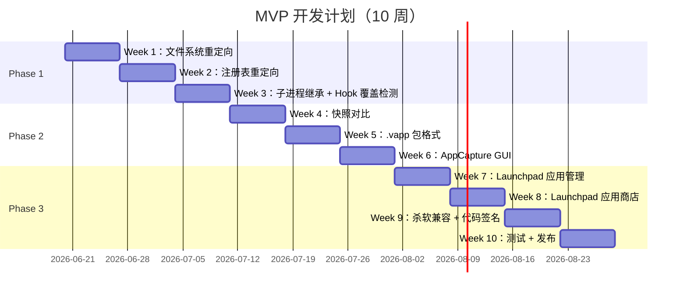

# MVP 开发计划 (MVP Plan)

> 本文档定义 AI ThinApp Portable Launchpad Platform 项目的 MVP（10 周）开发计划。
> 版本：0.1 | 日期：2026-05-23 | 作者：PM

---

## 1. 开发阶段划分（10 周，3 个阶段）

| 阶段 | 时间 | 目标 | 关键交付物 |
|------|------|------|------------|
| **Phase 1：Hook 引擎完善** | Week 1-3 | 修复 POC 限制，实现完整 Hook 引擎 | Hook 引擎 v1.0（文件/注册表/进程） |
| **Phase 2：应用捕获工具** | Week 4-6 | 实现 AppCapture + .vapp 格式 | AppCapture v1.0（捕获/导出/安装） |
| **Phase 3：Launchpad + 杀软兼容** | Week 7-10 | 实现 Launchpad 完整 UI + 代码签名 | Launchpad v1.0 + 代码签名证书 |

### 1.1 Phase 1：Hook 引擎完善（Week 1-3）

**目标**：修复 POC 阶段的限制，实现完整的 Hook 引擎（文件系统重定向、注册表重定向、子进程继承）。

**关键交付物**：
- `src\engine\vfs\vfs.cpp` - 文件系统重定向完整实现
- `src\engine\vreg\hive_manager.cpp` - 注册表重定向完整实现
- `src\engine\hook\process_inherit.cpp` - 子进程继承完整实现
- `tests\engine\test_vfs.cpp` - 文件系统重定向测试（10 个用例）
- `tests\engine\test_vreg.cpp` - 注册表重定向测试（10 个用例）
- `tests\engine\test_process.cpp` - 子进程继承测试（5 个用例）

### 1.2 Phase 2：应用捕获工具（Week 4-6）

**目标**：实现应用捕获工具（AppCapture），包括快照对比、.vapp 包格式、包安装器、GUI。

**关键交付物**：
- `src\packager\app_capture.cpp` - 应用捕获核心逻辑
- `src\packager\vapp_packager.cpp` - .vapp 包导出
- `src\packager\vapp_installer.cpp` - .vapp 包安装器
- `src\packager\app_capture_gui.cpp` - AppCapture GUI
- `tests\packager\test_app_capture.cpp` - AppCapture 测试（5 个用例）

### 1.3 Phase 3：Launchpad + 杀软兼容（Week 7-10）

**目标**：实现 Launchpad 完整 UI（应用管理、应用商店、托盘常驻），解决杀软兼容性问题（代码签名、白名单），发布 v0.1.0。

**关键交付物**：
- `src\launchpad\app_manager.cpp` - 应用管理
- `src\launchpad\ui\main_window.cpp` - Launchpad 主窗口
- `src\launchpad\store\store_api.cpp` - 应用商店 API
- `src\launchpad\store\store_ui.cpp` - 应用商店 UI
- `docs\CODE-SIGNING-GUIDE.md` - 代码签名指南
- `.github\workflows\code-sign.yml` - CI/CD 自动签名
- `docs\USER-MANUAL.md` - 用户手册
- `docs\FAQ.md` - 常见问题
- `CHANGELOG.md` - 变更日志

---

## 2. 详细任务拆解（每周）

### Week 1（Hook 引擎完善 - 文件系统重定向）

| 任务 ID | 任务名称 | 负责人 | 工时 | 产出 |
|---------|---------|--------|------|------|
| T1.1 | 修复 V2 限制（CoW 逻辑、写入重定向） | Dev A | 2d | `src\engine\vfs\vfs.cpp` |
| T1.2 | 实现 VFS 缓存（减少文件 IO） | Dev A | 1d | `src\engine\vfs\vfs_cache.cpp` |
| T1.3 | 编写文件系统重定向测试（10 个用例） | QA | 1d | `tests\engine\test_vfs.cpp` |
| T1.4 | 代码审查 + 修复 Bug | Dev A + QA | 1d | 代码审查报告 |

**验收标准**：文件操作 100% 重定向到 VFS（测试通过率 100%）

**交付物**：
- `src\engine\vfs\vfs.cpp`
- `src\engine\vfs\vfs_cache.cpp`
- `tests\engine\test_vfs.cpp`

---

### Week 2（Hook 引擎完善 - 注册表重定向）

| 任务 ID | 任务名称 | 负责人 | 工时 | 产出 |
|---------|---------|--------|------|------|
| T2.1 | 修复 V3 限制（Hive 格式优化、性能提升） | Dev B | 2d | `src\engine\vreg\hive_manager.cpp` |
| T2.2 | 实现注册表快照对比（用于 AppCapture） | Dev B | 1d | `src\engine\vreg\hive_snapshot.cpp` |
| T2.3 | 编写注册表重定向测试（10 个用例） | QA | 1d | `tests\engine\test_vreg.cpp` |
| T2.4 | 代码审查 + 修复 Bug | Dev B + QA | 1d | 代码审查报告 |

**验收标准**：注册表操作 100% 重定向到 hive（测试通过率 100%）

**交付物**：
- `src\engine\vreg\hive_manager.cpp`
- `src\engine\vreg\hive_snapshot.cpp`
- `tests\engine\test_vreg.cpp`

---

### Week 3（Hook 引擎完善 - 子进程继承 + Hook 覆盖检测）

| 任务 ID | 任务名称 | 负责人 | 工时 | 产出 |
|---------|---------|--------|------|------|
| T3.1 | 修复 V4 限制（CreateProcessInternalW 完整实现） | Lead | 2d | `src\engine\hook\process_inherit.cpp` |
| T3.2 | 实现 Hook 覆盖检测与自动重装 | Lead | 1d | `src\engine\hook\hook_watchdog.cpp` |
| T3.3 | 编写子进程继承测试（5 个用例） | QA | 1d | `tests\engine\test_process.cpp` |
| T3.4 | 代码审查 + 修复 Bug | Lead + QA | 1d | 代码审查报告 |

**验收标准**：子进程全部受 Hook 约束（3 层，测试通过率 100%）

**交付物**：
  - `src\engine\hook\process_inherit.cpp`
  - `src\engine\hook\hook_watchdog.cpp`
  - `tests\engine\test_process.cpp`

---

### Week 4（应用捕获工具 - 快照对比）

| 任务 ID | 任务名称 | 负责人 | 工时 | 产出 |
|---------|---------|--------|------|------|
| T4.1 | 实现文件系统快照创建/对比 | Dev A | 2d | `src\packager\file_snapshot.cpp` |
| T4.2 | 实现注册表快照创建/对比（使用 RegSaveKey） | Dev A | 2d | `src\packager\registry_snapshot.cpp` |
| T4.3 | 编写 AppCapture 测试（5 个用例） | QA | 1d | `tests\packager\test_app_capture.cpp` |
| T4.4 | 代码审查 + 修复 Bug | Dev A + QA | 1d | 代码审查报告 |

**验收标准**：捕获成功率 ≥ 90%（10 款应用中至少 9 款成功）

**交付物**：
- `src\packager\file_snapshot.cpp`
- `src\packager\registry_snapshot.cpp`
- `tests\packager\test_app_capture.cpp`

---

### Week 5（应用捕获工具 - .vapp 包格式）

| 任务 ID | 任务名称 | 负责人 | 工时 | 产出 |
|---------|---------|--------|------|------|
| T5.1 | 设计 .vapp 包格式（ZIP + JSON 元数据） | Lead + Dev B | 1d | `docs\VAPP-FORMAT.md` |
| T5.2 | 实现 .vapp 包导出（使用 zlib 压缩） | Dev B | 2d | `src\packager\vapp_packager.cpp` |
| T5.3 | 实现 .vapp 包安装器 | Dev B | 2d | `src\packager\vapp_installer.cpp` |
| T5.4 | 代码审查 + 修复 Bug | Dev B + QA | 1d | 代码审查报告 |

**验收标准**：安装成功率 100%（测试通过率 100%）

**交付物**：
- `docs\VAPP-FORMAT.md`
- `src\packager\vapp_packager.cpp`
- `src\packager\vapp_installer.cpp`

---

### Week 6（应用捕获工具 - GUI）

| 任务 ID | 任务名称 | 负责人 | 工时 | 产出 |
|---------|---------|--------|------|------|
| T6.1 | 实现 AppCapture GUI（Qt 6 或 WPF） | UX + Dev A | 3d | `src\packager\app_capture_gui.cpp` |
| T6.2 | 实现"捕获向导"（3 步：开始捕获 → 安装应用 → 完成） | UX + Dev A | 2d | `src\packager\capture_wizard.cpp` |
| T6.3 | 编写 AppCapture GUI 测试 | QA | 1d | `tests\packager\test_gui.cpp` |
| T6.4 | 代码审查 + 修复 Bug | Dev A + QA | 1d | 代码审查报告 |

**验收标准**：GUI 可正常使用，捕获流程清晰（可用性测试通过率 ≥ 80%）

**交付物**：
- `src\packager\app_capture_gui.cpp`
- `src\packager\capture_wizard.cpp`
- `tests\packager\test_gui.cpp`

---

### Week 7（Launchpad UI - 应用管理）

| 任务 ID | 任务名称 | 负责人 | 工时 | 产出 |
|---------|---------|--------|--------|------|
| T7.1 | 实现应用列表（从配置文件加载） | Dev A | 2d | `src\launchpad\app_manager.cpp` |
| T7.2 | 实现应用启动/停止（注入 Hook DLL） | Dev A | 2d | `src\launchpad\app_launcher.cpp` |
| T7.3 | 实现应用删除（删除目录 + 清理注册表） | Dev A | 1d | `src\launchpad\app_manager.cpp` (更新) |
| T7.4 | 实现 Launchpad 主窗口 UI | UX + Dev B | 2d | `src\launchpad\ui\main_window.cpp` |
| T7.5 | 代码审查 + 修复 Bug | Dev A + QA | 1d | 代码审查报告 |

**验收标准**：启动成功率 100%（测试通过率 100%）

**交付物**：
- `src\launchpad\app_manager.cpp`
- `src\launchpad\app_launcher.cpp`
- `src\launchpad\ui\main_window.cpp`

---

### Week 8（Launchpad UI - 应用商店）

| 任务 ID | 任务名称 | 负责人 | 工时 | 产出 |
|---------|---------|--------|------|------|
| T8.1 | 设计应用商店 API（RESTful，JSON 格式） | Lead + Dev B | 1d | `docs\STORE-API.md` |
| T8.2 | 实现应用商店 UI（浏览/搜索/下载/安装） | UX + Dev B | 3d | `src\launchpad\store\store_ui.cpp` |
| T8.3 | 实现应用商店后端 API | Dev B | 2d | `src\launchpad\store\store_api.cpp` |
| T8.4 | 编写应用商店测试 | QA | 1d | `tests\launchpad\test_store.cpp` |
| T8.5 | 代码审查 + 修复 Bug | Dev B + QA | 1d | 代码审查报告 |

**验收标准**：商店功能完整（浏览、搜索、下载、安装全部可用）

**交付物**：
- `docs\STORE-API.md`
- `src\launchpad\store\store_api.cpp`
- `src\launchpad\store\store_ui.cpp`
- `tests\launchpad\test_store.cpp`

---

### Week 9（杀软兼容 - 代码签名）

| 任务 ID | 任务名称 | 负责人 | 工时 | 产出 |
|---------|---------|--------|------|------|
| T9.1 | 申请代码签名证书（OV 或 EV） | PM | 持续 | 代码签名证书（.pfx 文件） |
| T9.2 | 配置 CI/CD 自动签名（GitHub Actions） | Dev Ops | 2d | `.github\workflows\code-sign.yml` |
| T9.3 | 提交杀软白名单申请（360、腾讯管家等） | PM | 持续 | 白名单申请记录 |
| T9.4 | 编写代码签名指南 | PM + Dev Ops | 1d | `docs\CODE-SIGNING-GUIDE.md` |
| T9.5 | VirusTotal 扫描测试 | QA | 1d | 杀软兼容性测试报告（更新） |

**验收标准**：主流杀软误报率 ≤ 10%（VirusTotal 扫描，50+ 引擎中 ≤ 5 个报毒）

**交付物**：
- 代码签名证书（.pfx 文件）
- `.github\workflows\code-sign.yml`
- `docs\CODE-SIGNING-GUIDE.md`
- 杀软兼容性测试报告（更新）

---

### Week 10（测试 + 发布）

| 任务 ID | 任务名称 | 负责人 | 工时 | 产出 |
|---------|---------|--------|------|------|
| T10.1 | 集成测试（Hook 引擎 + AppCapture + Launchpad） | QA + Dev A + Dev B | 3d | 集成测试报告 |
| T10.2 | 用户文档（用户手册、FAQ、视频教程） | PM + UX | 3d | `docs\USER-MANUAL.md`、`docs\FAQ.md`、视频教程 |
| T10.3 | 发布 v0.1.0（GitHub Release + 应用商店） | PM + Dev Ops | 2d | GitHub Release v0.1.0、应用商店上线 |
| T10.4 | 编写 CHANGELOG | PM | 1d | `CHANGELOG.md` |
| T10.5 | 发布前的最后检查 | PM + QA | 1d | 发布检查清单 |

**验收标准**：所有成功标准达成（S1-S5 全部通过）

**交付物**：
- 集成测试报告
- `docs\USER-MANUAL.md`
- `docs\FAQ.md`
- 视频教程（MP4）
- GitHub Release v0.1.0
- 应用商店上线
- `CHANGELOG.md`

---

## 3. 风险登记（MVP 阶段）

| 风险 ID | 风险描述 | 影响 | 概率 | 等级 | 缓释措施 | 负责人 | 状态 |
|----------|----------|------|------|----------|----------|--------|------|
| R-MVP-01 | Hook 引擎性能问题（文件/注册表 IO 瓶颈） | 高 | 中 | 高 | 实现缓存机制（VFS 缓存），优化 IO 路径 | Dev A | 开放 |
| R-MVP-02 | 应用捕获失败率高（复杂应用无法捕获） | 高 | 中 | 高 | 优先捕获 10 款常用应用，逐步扩展；提供用户自定义规则 | Dev A + QA | 开放 |
| R-MVP-03 | 杀软误报率高（代码签名无效） | 高 | 高 | 极高 | 申请 EV 证书（~$200-400/年），提前提交白名单申请 | PM | 开放 |
| R-MVP-04 | Launchpad UI 开发进度延迟 | 中 | 中 | 中 | 使用 Qt 6 快速原型开发；优先级排序，先做核心功能 | UX + Dev B | 开放 |
| R-MVP-05 | 团队成员离职或请假 | 中 | 低 | 低 | 文档齐全，代码注释清晰；交叉培训（Cross-training） | PM | 开放 |
| R-MVP-06 | .vapp 包格式设计不合理（性能差或兼容性差） | 中 | 中 | 中 | MVP 阶段使用 ZIP + JSON（简单，人类可读）；V2 阶段迁移到二进制格式 | Lead | 开放 |
| R-MVP-07 | 应用商店后端 API 开发延迟 | 中 | 中 | 中 | 使用第三方服务（如 GitHub API）作为临时方案；MVP 阶段仅提供基础功能 | Dev B | 开放 |
| R-MVP-08 | 代码签名证书申请延迟（需 1-2 周） | 高 | 中 | 高 | Week 1 就开始申请（提前启动）；若延迟，先发布未签名版本（提示用户） | PM | 开放 |

### 3.1 风险处理计划

#### 极高等级风险（立即处理）

| ID | 风险 | 处理方案 | 截止日期 | 负责人 |
|----|------|----------|----------|--------|
| R-MVP-03 | 杀软误报率高 | 申请 EV 证书 + 提前提交白名单 | Week 1 启动 | PM |

#### 高等级风险（本周内处理）

| ID | 风险 | 处理方案 | 截止日期 | 负责人 |
|----|------|----------|----------|--------|
| R-MVP-01 | Hook 引擎性能问题 | 实现 VFS 缓存（Week 1） | Week 1 结束 | Dev A |
| R-MVP-02 | 应用捕获失败率高 | 优先捕获 10 款常用应用 | Week 6 结束 | Dev A + QA |
| R-MVP-08 | 代码签名证书申请延迟 | Week 1 启动申请流程 | Week 1 结束 | PM |

---

## 4. 依赖关系

### 4.1 任务依赖图



### 4.2 关键路径

**关键路径**（最长路径，决定项目总工期）：
```
Week 1 → Week 2 → Week 3 → Week 4 → Week 5 → Week 6 → Week 7 → Week 8 → Week 9 → Week 10
```

**总工期**：10 周（70 天）

### 4.3 任务依赖关系

| 任务 | 依赖任务 | 说明 |
|------|----------|------|
| T2.1（注册表重定向） | T1.1（文件系统重定向） | 需要先理解 Hook 引擎框架 |
| T3.1（子进程继承） | T1.1 + T2.1 | 需要文件系统和注册表重定向都稳定 |
| T4.1（文件系统快照） | T1.1（文件系统重定向） | 需要理解 VFS 路径映射规则 |
| T4.2（注册表快照） | T2.1（注册表重定向） | 需要理解虚拟 hive 格式 |
| T5.2（.vapp 包导出） | T4.1 + T4.2 | 需要快照对比功能 |
| T6.1（AppCapture GUI） | T5.2（.vapp 包导出） | 需要核心逻辑完成后才能做 GUI |
| T7.2（应用启动） | T3.1（子进程继承） | 需要 Hook 继承稳定 |
| T8.2（应用商店 UI） | T7.1（应用列表） | 需要先有应用管理基础 |
| T9.2（CI/CD 自动签名） | T9.1（代码签名证书） | 需要先获得证书 |
| T10.1（集成测试） | 所有前置任务 | 需要所有功能都完成 |

---

## 5. 资源需求

### 5.1 人力资源

| 角色 | 人数 | 投入 | 职责 |
|------|------|------|------|
| Windows 底层开发 Lead | 1 | 全职（10 周） | Hook 引擎、架构设计、代码审查 |
| Windows 开发工程师 A | 1 | 全职（10 周） | 文件系统虚拟化、应用捕获工具 |
| Windows 开发工程师 B | 1 | 全职（10 周） | 注册表虚拟化、Launchpad 后端 |
| UX 专家 | 1 | 全职（10 周） | Launchpad UI 设计、可用性测试 |
| 测试工程师 | 1 | 全职（10 周） | 测试计划、测试执行、测试报告 |
| PM | 1 | 全职（10 周） | 项目管理、文档、沟通 |
| Dev Ops | 1 | 兼职（Week 9-10，共 2 周） | CI/CD、代码签名、发布 |

### 5.2 硬件资源

- 开发机（Windows 10/11，x86-64）× 4
- 虚拟机（VMware Workstation）× 2（快照测试、干净环境测试）
- 测试机（干净 Windows 环境）× 2

### 5.3 软件资源

- Visual Studio 2022 Community（免费）
- MinHook（开源，MIT）
- Qt 6（开源，LGPL）
- zlib（开源，zlib 协议）
- GitHub Actions（CI/CD，免费额度）
- Figma（免费版，UX 原型）

---

## 6. 沟通计划

| 频率 | 参会人 | 议程 |
|------|--------|------|
| 每日站会（15 分钟） | 全体 | 昨日进展 / 今日计划 / 阻塞项 |
| Week 1 结束评审 | 全体 | Hook 引擎演示（文件系统重定向） |
| Week 3 结束评审 | 全体 | Hook 引擎完整演示（文件+注册表+进程） |
| Week 6 结束评审 | 全体 | AppCapture 演示（捕获+导出+安装） |
| Week 8 结束评审 | 全体 | Launchpad UI 演示（应用管理+商店） |
| Week 10 结束评审（发布评审） | 全体 + 决策者 | MVP 完整演示 + 发布决策 |

---

## 7. 修订历史

| 版本 | 日期 | 作者 | 变更说明 |
|------|------|------|----------|
| 0.1 | 2026-05-23 | PM | 初版，基于 POC 计划和讨论输出 |

---

## 附录：MVP 开发计划检查清单

**使用前**：复制此清单到任务管理工具（如 Jira、GitHub Projects），逐项勾选。

### Phase 1：Hook 引擎完善（Week 1-3）

- [ ] Week 1：文件系统重定向完整实现
- [ ] Week 1：VFS 缓存实现
- [ ] Week 1：文件系统重定向测试（10 个用例）
- [ ] Week 2：注册表重定向完整实现
- [ ] Week 2：注册表快照对比实现
- [ ] Week 2：注册表重定向测试（10 个用例）
- [ ] Week 3：子进程继承完整实现（3 层）
- [ ] Week 3：Hook 覆盖检测与自动重装
- [ ] Week 3：子进程继承测试（5 个用例）

### Phase 2：应用捕获工具（Week 4-6）

- [ ] Week 4：文件系统快照创建/对比
- [ ] Week 4：注册表快照创建/对比
- [ ] Week 4：AppCapture 测试（5 个用例）
- [ ] Week 5：.vapp 包格式设计
- [ ] Week 5：.vapp 包导出实现
- [ ] Week 5：.vapp 包安装器实现
- [ ] Week 6：AppCapture GUI 实现
- [ ] Week 6："捕获向导"实现
- [ ] Week 6：AppCapture GUI 测试

### Phase 3：Launchpad + 杀软兼容（Week 7-10）

- [ ] Week 7：应用列表实现
- [ ] Week 7：应用启动/停止实现
- [ ] Week 7：应用删除实现
- [ ] Week 7：Launchpad 主窗口 UI 实现
- [ ] Week 8：应用商店 API 设计
- [ ] Week 8：应用商店 UI 实现
- [ ] Week 8：应用商店后端 API 实现
- [ ] Week 8：应用商店测试
- [ ] Week 9：代码签名证书申请
- [ ] Week 9：CI/CD 自动签名配置
- [ ] Week 9：杀软白名单申请
- [ ] Week 9：代码签名指南
- [ ] Week 10：集成测试
- [ ] Week 10：用户文档（用户手册、FAQ、视频教程）
- [ ] Week 10：发布 v0.1.0（GitHub Release + 应用商店）
- [ ] Week 10：CHANGELOG 编写

### 成功标准

- [ ] S1：Hook 引擎稳定性测试通过（24 小时无崩溃）
- [ ] S2：3 款基准应用便携化测试通过
- [ ] S3：10 款应用捕获测试通过（成功率 ≥ 90%）
- [ ] S4：Launchpad UI 测试通过
- [ ] S5：杀软误报率测试通过（≤ 10%）
