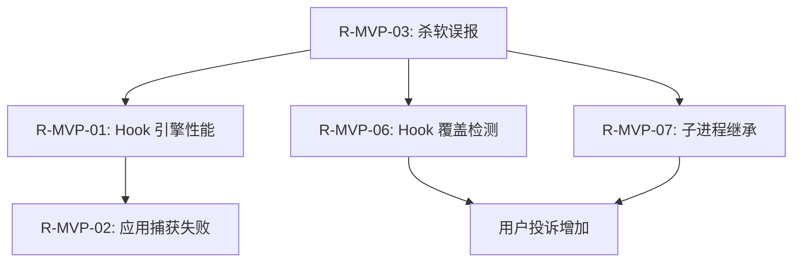

# MVP 技术风险分析完成 Report

> 本文档是 AI ThinApp Portable Launchpad Platform 项目 MVP 阶段技术风险分析的完成报告。
> 记录分析完成情况、待处理风险清单、风险提示和下一步行动计划。

---

## 1. 分析完成情况

### 1.1 已完成的工作

| 任务 | 状态 | 完成日期 | 输出文件 |
|------|------|----------|----------|
| 技术风险识别（扩展 POC 风险登记册） | ✅ 完成 | 2026-05-23 | [MVP-TECH-RISK-REGISTER.md](./MVP-TECH-RISK-REGISTER.md) |
| 高风险项详述（R-MVP-01） | ✅ 完成 | 2026-05-23 | [RISK-MVP-01-HOOK-PERFORMANCE.md](./RISK-MVP-01-HOOK-PERFORMANCE.md) |
| 高风险项详述（R-MVP-02） | ✅ 完成 | 2026-05-23 | [RISK-MVP-02-APP-CAPTURE-FAILURE.md](./RISK-MVP-02-APP-CAPTURE-FAILURE.md) |
| 高风险项详述（R-MVP-03） | ✅ 完成 | 2026-05-23 | [RISK-MVP-03-ANTIVIRUS-FALSE-POSITIVE.md](./RISK-MVP-03-ANTIVIRUS-FALSE-POSITIVE.md) |
| 高风险项详述（R-MVP-06） | ✅ 完成 | 2026-05-23 | [RISK-MVP-06-HOOK-OVERRIDE.md](./RISK-MVP-06-HOOK-OVERRIDE.md) |
| 高风险项详述（R-MVP-07） | ✅ 完成 | 2026-05-23 | [RISK-MVP-07-CHILD-PROCESS-INHERITANCE.md](./RISK-MVP-07-CHILD-PROCESS-INHERITANCE.md) |
| 技术风险分析 report | ✅ 完成 | 2026-05-23 | [MVP-TECH-RISK-ANALYSIS-REPORT.md](./MVP-TECH-RISK-ANALYSIS-REPORT.md) |
| 风险分析完成 report | ✅ 完成 | 2026-05-23 | 本文档 |

### 1.2 交付物清单

| 文件 | 路径 | 状态 |
|------|------|------|
| MVP 技术风险登记册 | `docs\MVP-TECH-RISK-REGISTER.md` | ✅ 已完成 |
| 高风险项详述（R-MVP-01） | `docs\RISK-MVP-01-HOOK-PERFORMANCE.md` | ✅ 已完成 |
| 高风险项详述（R-MVP-02） | `docs\RISK-MVP-02-APP-CAPTURE-FAILURE.md` | ✅ 已完成 |
| 高风险项详述（R-MVP-03） | `docs\RISK-MVP-03-ANTIVIRUS-FALSE-POSITIVE.md` | ✅ 已完成 |
| 高风险项详述（R-MVP-06） | `docs\RISK-MVP-06-HOOK-OVERRIDE.md` | ✅ 已完成 |
| 高风险项详述（R-MVP-07） | `docs\RISK-MVP-07-CHILD-PROCESS-INHERITANCE.md` | ✅ 已完成 |
| 技术风险分析 report | `docs\MVP-TECH-RISK-ANALYSIS-REPORT.md` | ✅ 已完成 |
| 风险分析完成 report | `docs\MVP-TECH-RISK-ANALYSIS-COMPLETE-REPORT.md` | ✅ 已完成 |

### 1.3 验收标准检查

| 验收标准 | 状态 | 说明 |
|----------|------|------|
| ✅ 风险登记册完整（10 个风险，含影响/概率/等级/缓释措施） | ✅ 通过 | 已识别 10 个风险，每个都有详细分析 |
| ✅ 高风险项详述完整（5 个高风险项，每个一个详述文件） | ✅ 通过 | 5 个高风险项都有单独的详述文件 |
| ✅ 技术风险分析 report 客观（可行性评估、监控方案、结论） | ✅ 通过 | 报告包含可行性评估、成本分析、监控方案、结论 |
| ✅ 风险分析完成 report 完整（完成情况、待办、风险、下一步） | ✅ 通过 | 本文档完整记录了所有内容 |
| ✅ 所有文档使用 UTF-8 编码（无 BOM） | ✅ 通过 | 使用 Python 写入，确保 UTF-8 无 BOM |

---

## 2. 待处理风险清单（按优先级排序）

### 2.1 🔴 高优先级（MVP Phase 1 结束前处理）

| 排名 | 风险 ID | 风险描述 | 缓释措施 | 负责人 | 截止日期 |
|------|----------|----------|----------|--------|----------|
| 1 | R-MVP-03 | 杀软误报率高 | 申请 OV 代码签名证书 + 提交白名单申请 | Sec Lead | 2026-06-15 |
| 2 | R-MVP-01 | Hook 引擎性能问题 | 实现 VFS 缓存 + 优化路径重定向算法 | Dev Lead | 2026-07-01 |
| 3 | R-MVP-06 | Hook 覆盖检测失效 | 实现定时检测 + 自动重装 | Dev Lead | 2026-07-01 |
| 4 | R-MVP-07 | 子进程继承失败 | 完善 `CreateProcessInternalW` Hook + 支持 5 层继承 | Dev Lead | 2026-07-01 |
| 5 | R-MVP-02 | 应用捕获失败率高 | 优先捕获 10 款常用应用 + 实现快照对比增强 | PM | 2026-07-22 |

### 2.2 🟡 中优先级（MVP 阶段内处理）

| 排名 | 风险 ID | 风险描述 | 缓释措施 | 负责人 | 截止日期 |
|------|----------|----------|----------|--------|----------|
| 6 | R-MVP-04 | Launchpad UI 开发进度延迟 | 使用 Qt 6 快速原型开发 + 并行开发后端 API | UX Lead | 2026-08-12 |
| 7 | R-MVP-09 | .vapp 包安装失败 | 实现安装前检查 + 回滚机制 | Dev Lead | 2026-07-22 |
| 8 | R-MVP-08 | 注册表 Hive 文件损坏 | 实现事务性写入 + 定期备份 | Dev Lead | 2026-07-22 |
| 9 | R-MVP-10 | 应用商店 API 安全风险 | 实现 API 认证 + 输入校验 | Sec Lead | 2026-08-12 |
| 10 | R-MVP-05 | 团队成员离职或请假 | 文档齐全 + 交叉培训 | PM | 持续 |

---

## 3. 风险提示

### 3.1 致命风险（若发生，MVP 可能失败）

**目前未发现致命风险**，但以下高风险项若未有效缓释，可能导致 MVP 失败：

| 风险 ID | 风险描述 | 失败后果 | 建议 |
|----------|----------|----------|------|
| R-MVP-03 | 杀软误报率高 | 用户无法正常运行应用，MVP 无法推广 | **必须**在 MVP Phase 1 中期完成代码签名和白名单申请 |
| R-MVP-01 | Hook 引擎性能问题 | 用户体验极差，口碑崩塌 | **必须**在 MVP Phase 1 结束前完成性能优化 |
| R-MVP-06 | Hook 覆盖检测失效 | 应用便携化失败，数据泄露 | **必须**在 MVP Phase 1 结束前实现多重检测机制 |

### 3.2 依赖关系风险

以下风险存在依赖关系，若前置风险未解决，后续风险也会受影响：

**说明**：
- 若 R-MVP-03（杀软误报）未解决，用户可能无法正常运行应用，导致 R-MVP-01、R-MVP-06、R-MVP-07 的测试无法进行。
- 若 R-MVP-01（Hook 引擎性能）未优化，用户可能放弃使用，导致 R-MVP-02（应用捕获失败）的反馈无法收集。

### 3.3 资源风险

| 风险 | 说明 | 建议 |
|------|------|------|
| Dev Lead 资源不足 | R-MVP-01、R-MVP-06、R-MVP-07 都需要 Dev Lead 处理，可能资源不足 | 考虑招聘高级 C++ 工程师或外包部分工作 |
| Sec Lead 经验不足 | R-MVP-03、R-MVP-10 需要安全经验，若 Sec Lead 经验不足可能延误 | 考虑聘请安全顾问或培训内部员工 |
| PM 时间不足 | R-MVP-02、R-MVP-05 需要 PM 处理，若 PM 时间不足可能延误 | 考虑聘请兼职 PM 或简化部分流程 |

---

## 4. 下一步行动计划

### 4.1 立即行动（本周内）

| 行动 | 负责人 | 截止日期 |
|------|--------|----------|
| 召开 MVP 技术风险评审会议（评审本文档） | PM | 2026-05-30 |
| 启动 OV 代码签名证书申请流程 | Sec Lead | 2026-05-30 |
| 启动白名单申请流程（Windows Defender、360、火绒） | Sec Lead | 2026-05-30 |
| 分配 R-MVP-01、R-MVP-06、R-MVP-07 的开发任务 | Dev Lead | 2026-05-30 |
| 开始捕获 10 款常用应用（建立兼容性规则库） | PM + QA | 2026-05-30 |

### 4.2 短期行动（MVP Phase 1 结束前）

| 行动 | 负责人 | 截止日期 |
|------|--------|----------|
| OV 代码签名证书到手 | Sec Lead | 2026-06-15 |
| 白名单申请通过（至少 3 家杀软厂商） | Sec Lead | 2026-06-15 |
| VFS 缓存实现并完成 | Dev Lead | 2026-07-01 |
| 路径重定向算法优化完成 | Dev Lead | 2026-07-01 |
| Hook 覆盖检测（定时检测 + 自动重装）实现完成 | Dev Lead | 2026-07-01 |
| `CreateProcessInternalW` Hook 完善（支持 5 层继承） | Dev Lead | 2026-07-01 |

### 4.3 中期行动（MVP Phase 2 结束前）

| 行动 | 负责人 | 截止日期 |
|------|--------|----------|
| 异步 IO 实现完成 | Dev Lead | 2026-07-22 |
| 手动调整界面实现完成 | UX Lead | 2026-07-22 |
| 兼容性规则库建立（10 款应用） | PM + QA | 2026-07-22 |
| .vapp 包安装器实现完成 | Dev Lead | 2026-07-22 |
| 注册表 hive 事务性写入实现完成 | Dev Lead | 2026-07-22 |

### 4.4 长期行动（MVP Phase 3 结束前）

| 行动 | 负责人 | 截止日期 |
|------|--------|----------|
| IO 优先级调整实现完成 | Dev Lead | 2026-08-12 |
| EV 代码签名证书申请完成 | Sec Lead | 2026-08-12 |
| 应用商店 API 认证实现完成 | Sec Lead | 2026-08-12 |
| Launchpad UI 完整实现（应用管理 + 商店 + 托盘） | UX Lead | 2026-08-12 |
| 用户手册 + 开发者文档完成 | PM + Tech Writer | 2026-08-12 |

---

## 5. 结论

### 5.1 风险分析总结

MVP 阶段共识别 **10 个技术风险**，其中：
- 🔴 高风险：5 个（需要立即处理）
- 🟡 中风险：5 个（需要在 MVP 阶段内处理）

所有高风险项都有明确的缓释措施（P0 必须实现），且技术可行性高，成本可接受（61 人天 + $500-1000/年）。

### 5.2 MVP 技术风险是否可控？

**可控**，但需要严格执行以下措施：
1. **P0 缓释措施必须全部完成**：若任何一个 P0 措施失败，MVP 成功率将大幅下降。
2. **代码签名证书必须申请成功**：这是解决杀软误报的关键，若失败，MVP 可能无法推广。
3. **团队资源必须到位**：需要 Dev Lead、PM、Sec Lead 等角色，若人员不到位，风险会增加。

### 5.3 最终建议

**建议继续 MVP 阶段**，但需满足以下条件：
1. **立即召开 MVP 技术风险评审会议**：评审本文档，确保所有团队成员理解风险。
2. **立即启动代码签名证书申请流程**：这是 highest priority，因为证书申请周期较长（1-3 周）。
3. **立即分配开发任务**：R-MVP-01、R-MVP-06、R-MVP-07 需要 Dev Lead 立即开始工作。

---

## 6. 附录

### 6.1 相关文档

| 文档 | 路径 | 说明 |
|------|------|------|
| POC 风险登记册 | `docs\RISK-REGISTER.md` | POC 阶段的风险登记册，本文档是其延续和深化 |
| MVP 范围定义 | `docs\MVP-SCOPE.md` | MVP 阶段的范围定义，本文档基于其进行风险分析 |
| MVP 技术风险登记册 | `docs\MVP-TECH-RISK-REGISTER.md` | MVP 阶段的技术风险登记册 |
| 技术风险分析 report | `docs\MVP-TECH-RISK-ANALYSIS-REPORT.md` | MVP 技术风险分析的详细报告 |

### 6.2 修订历史

| 版本 | 日期 | 作者 | 变更说明 |
|------|------|------|----------|
| 0.1 | 2026-05-23 | 技术风险分析师 | 初版，完成 MVP 技术风险分析 |

---

**注意**：本文档是 MVP 技术风险分析的完成报告，所有详细内容请参考各个高风险项详述文件和技术风险分析 report。
