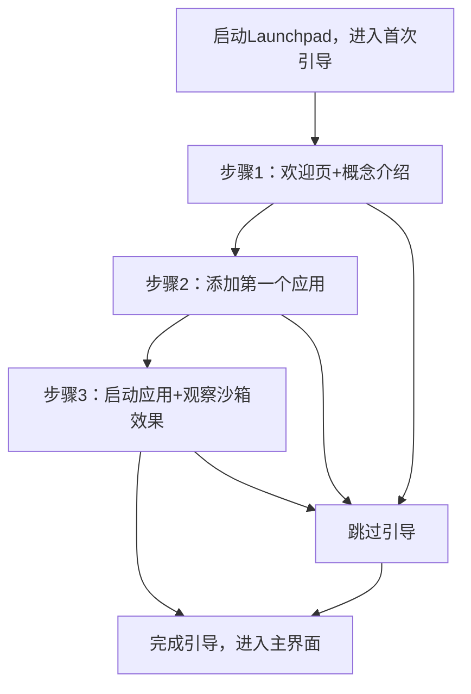
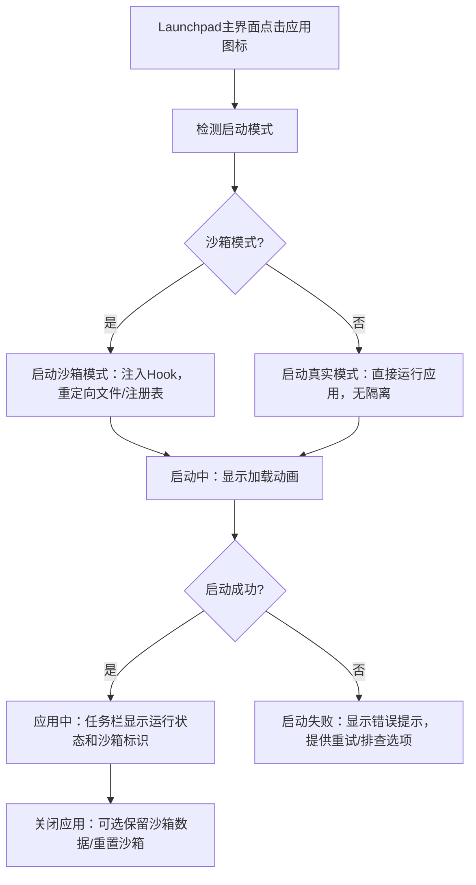
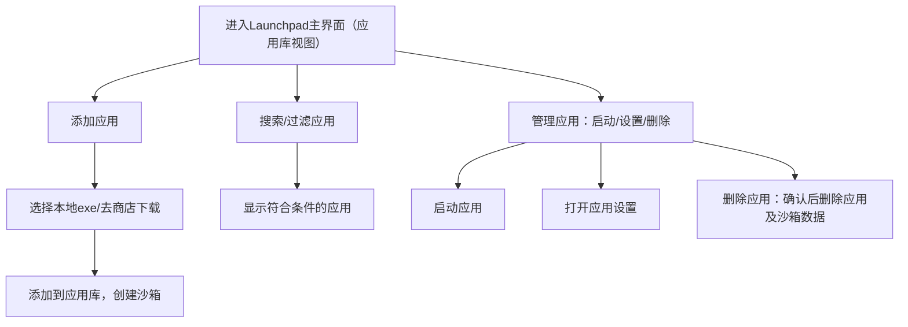
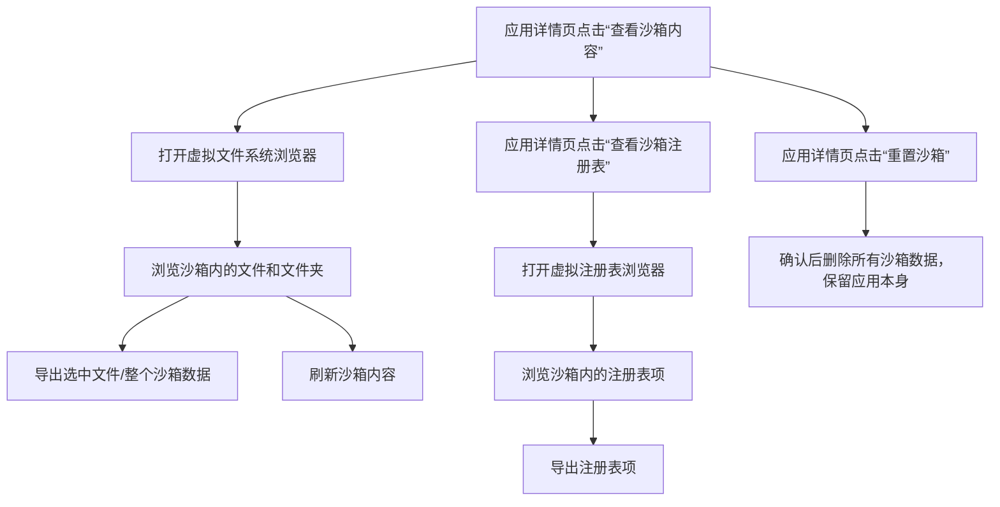
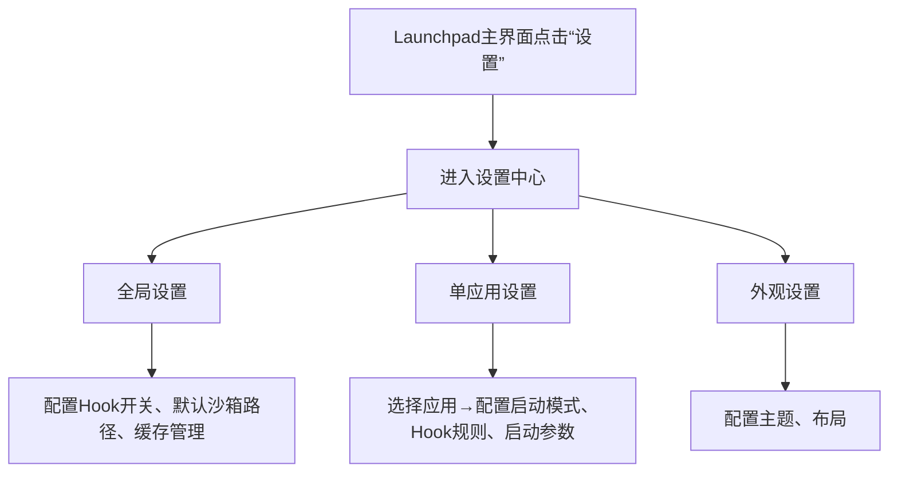

# 交互设计文档

## 1. 核心交互流程设计

### 1.1 首次使用引导流程（3步教学）
#### 流程目标
让新用户在3步内理解产品核心价值，完成首个应用的添加和启动，感知便携化和沙箱隔离的效果。

#### 流程步骤


#### 步骤详情
1. **步骤1：欢迎页+概念介绍**
   - 内容：欢迎使用AI ThinApp Portable Launchpad Platform，每个软件自带独立运行空间，不用安装，不写系统，随处可用。
   - 操作：[下一步]按钮，[跳过引导]链接。

2. **步骤2：添加第一个应用**
   - 内容：选择本地已有的exe文件，或者去软件商店下载应用。
   - 操作：[选择本地文件]按钮，[去商店下载]按钮，[跳过]链接。
   - 本地文件选择：打开文件选择器，选择exe文件后自动创建沙箱并添加到应用库。

3. **步骤3：启动应用+观察沙箱效果**
   - 内容：启动刚刚添加的应用，弹窗提示“看，应用的文件都保存在{AppDir}目录里，不会写到系统盘！”。
   - 操作：[完成]按钮，[查看详情]链接（打开沙箱内容浏览器）。
   - 效果验证：用户可手动打开应用目录，确认文件都保存在该目录内。

---

### 1.2 应用启动流程（核心场景）
#### 流程目标
让用户能快速启动应用，清晰感知应用的运行状态（沙箱模式/真实模式），并处理启动过程中的异常。

#### 流程步骤


#### 设计细节
- **启动模式切换**：应用详情页提供“沙箱模式”/“真实模式”切换开关，切换时需确认（真实模式会修改系统）。
- **启动中状态**：应用图标显示加载动画（旋转进度条），主界面顶部显示“正在启动{应用名}...”。
- **启动失败提示**：弹窗显示错误原因（如“文件缺失”“Hook安装失败”“杀软阻止”），提供“重试”“查看日志”“检查杀软设置”按钮。
- **运行中状态**：任务栏图标显示沙箱标识（绿色角标✅），鼠标悬停显示“{应用名}（沙箱模式中）”；窗口边框显示为绿色（可选）。

---

### 1.3 应用库管理流程
#### 流程目标
让用户能方便的管理应用库，包括添加、搜索、过滤、删除应用，清晰查看应用状态。

#### 流程步骤


#### 设计细节
- **添加应用**：主界面顶部提供[添加应用]按钮，点击后选择“本地文件”或“商店下载”。
- **应用卡片设计**：
  | 元素 | 说明 |
  |------|------|
  | 应用图标 | 大图标（64x64），显示应用logo |
  | 应用名称 | 主标题，显示应用名称 |
  | 版本 | 副标题，显示当前版本 |
  | 状态标识 | 标签：“已便携化”“运行中”“未安装”“有更新” |
  | 操作按钮 | [启动][设置][删除]（更多操作通过右键菜单） |
- **搜索和过滤**：顶部提供搜索框（按名称搜索），过滤条件（全部/运行中/已安装/未安装/有更新）。
- **应用删除**：点击删除按钮后弹窗确认：“删除该应用将同时删除其沙箱数据，是否确认？”，防止误删。

---

### 1.4 沙箱内容浏览流程
#### 流程目标
让用户能直观查看和管理沙箱内的文件与注册表项，支持导出和重置操作。

#### 流程步骤


#### 设计细节
- **虚拟文件系统浏览器**：
  - 界面类似Windows文件资源管理器，左侧为虚拟目录树（C盘、D盘、注册表等），右侧为文件列表。
  - 支持文件操作：复制、粘贴、删除、重命名（仅限沙箱内文件）。
  - 导出功能：选择文件/文件夹→[导出]→选择导出路径→保存到本地或U盘。
- **虚拟注册表浏览器**：
  - 界面类似Windows注册表编辑器，左侧为注册表项树，右侧为键值列表。
  - 支持键值操作：修改、删除、导出。
- **重置沙箱**：点击后弹窗确认：“重置沙箱将删除所有沙箱数据（文件、注册表），保留应用本身，是否确认？”，确认后执行重置。

---

### 1.5 设置流程
#### 流程目标
让用户能配置全局设置、单应用设置和外观设置，满足不同用户的需求。

#### 流程步骤


#### 设计细节
- **全局设置**：
  - Hook开关：启用/禁用全局Hook（文件/注册表拦截）。
  - 默认沙箱路径：设置沙箱数据的默认保存路径（如D:\ThinAppSandbox）。
  - 缓存管理：[清理全局缓存]按钮，清理临时文件和日志。
- **单应用设置**：
  - 选择应用：下拉列表选择已安装的应用。
  - 启动模式：沙箱模式/真实模式（默认沙箱模式）。
  - Hook规则：允许/禁止某些文件或注册表操作（高级用户选项）。
  - 启动参数：添加自定义命令行启动参数。
- **外观设置**：
  - 主题：浅色/深色/自动（跟随系统）。
  - 布局：卡片视图/列表视图（应用库布局）。

---

## 2. 界面线框图（ASCII艺术）

### 2.1 Launchpad主界面（应用库视图）
```
+---------------------------------------------------------------+
|  AI ThinApp Launchpad                [搜索框] [商店] [设置]   |
+---------------------------------------------------------------+
|  [添加应用]  [全部] [运行中] [已安装] [未安装] [有更新]      |
+---------------------------------------------------------------+
|  +----------------+  +----------------+  +----------------+  |
|  | [图标]         |  | [图标]         |  | [图标]         |  |
|  | 应用名称1      |  | 应用名称2      |  | 应用名称3      |  |
|  | 版本: 1.0.0   |  | 版本: 2.3.1   |  | 版本: 3.2.0   |  |
|  | 状态: 已便携化 |  | 状态: 运行中   |  | 状态: 未安装   |  |
|  | [启动] [设置]  |  | [启动] [设置]  |  | [安装] [详情]  |  |
|  +----------------+  +----------------+  +----------------+  |
|  +----------------+  +----------------+  +----------------+  |
|  | [图标]         |  | [图标]         |  | [图标]         |  |
|  | 应用名称4      |  | 应用名称5      |  | 应用名称6      |  |
|  | 版本: 4.1.2   |  | 版本: 5.0.0   |  | 版本: 6.2.1   |  |
|  | 状态: 有更新   |  | 状态: 已便携化 |  | 状态: 运行中   |  |
|  | [启动] [设置]  |  | [启动] [设置]  |  | [启动] [设置]  |  |
|  +----------------+  +----------------+  +----------------+  |
+---------------------------------------------------------------+
|  状态栏：3个应用运行中 | 沙箱模式已启用                       |
+---------------------------------------------------------------+
```

---

### 2.2 应用详情页
```
+---------------------------------------------------------------+
|  [返回]  应用详情 - 应用名称1                [启动] [删除]     |
+---------------------------------------------------------------+
|  [大图标]  应用名称1  版本: 1.0.0  状态: 已便携化，未运行   |
|  描述：这是一款XXX应用，支持XXX功能...                         |
+---------------------------------------------------------------+
|  [查看沙箱内容]  [查看沙箱注册表]  [重置沙箱]  [导出沙箱]    |
|  [启动模式：沙箱模式]  [Hook规则]  [启动参数]                |
+---------------------------------------------------------------+
|  最近活动：                                                   |
|  - 2026-05-20 10:30 启动应用                                 |
|  - 2026-05-19 15:20 重置沙箱                                 |
+---------------------------------------------------------------+
```

---

### 2.3 软件商店首页
```
+---------------------------------------------------------------+
|  AI ThinApp 商店                        [搜索框] [分类] [排序]|
+---------------------------------------------------------------+
|  [分类] 办公软件 | 开发工具 | 游戏 | 工具 | 媒体 | 其他      |
+---------------------------------------------------------------+
|  +----------------+  +----------------+  +----------------+  |
|  | [图标]         |  | [图标]         |  | [图标]         |  |
|  | 应用名称A      |  | 应用名称B      |  | 应用名称C      |  |
|  | 评分: ★★★★☆  |  | 评分: ★★★☆☆  |  | 评分: ★★★★★  |  |
|  | 下载量: 1.2k  |  | 下载量: 850   |  | 下载量: 3.5k  |  |
|  | [安装]         |  | [安装]         |  | [安装]         |  |
|  +----------------+  +----------------+  +----------------+  |
|  +----------------+  +----------------+  +----------------+  |
|  | [图标]         |  | [图标]         |  | [图标]         |  |
|  | 应用名称D      |  | 应用名称E      |  | 应用名称F      |  |
|  | 评分: ★★★★☆  |  | 评分: ★★☆☆☆  |  | 评分: ★★★★☆  |  |
|  | 下载量: 2.1k  |  | 下载量: 450   |  | 下载量: 1.8k  |  |
|  | [安装]         |  | [安装]         |  | [安装]         |  |
|  +----------------+  +----------------+  +----------------+  |
+---------------------------------------------------------------+
```

---

### 2.4 首次使用引导页（3步）
#### 步骤1：欢迎页+概念介绍
```
+---------------------------------------------------------------+
|  [Logo]  欢迎使用 AI ThinApp Portable Launchpad Platform      |
|                                                               |
|  让每个软件自带独立运行空间，不用安装，不写系统，随处可用。    |
|                                                               |
|  ✅ 应用文件全部保存在自身目录内，重装系统不丢失              |
|  ✅ 软件不会产生系统垃圾，C盘永远干净                          |
|  ✅ 复制应用目录到U盘，到其他电脑也能直接运行                  |
|                                                               |
|  [下一步]                                    [跳过引导]        |
+---------------------------------------------------------------+
```

#### 步骤2：添加第一个应用
```
+---------------------------------------------------------------+
|  添加你的第一个应用                                           |
|                                                               |
|  选择本地已有的exe文件，或者去软件商店下载应用。              |
|                                                               |
|  [选择本地文件]  [去商店下载]                                 |
|                                                               |
|  💡 提示：本地文件会自动创建独立运行空间，无需手动配置。      |
|                                                               |
|  [跳过]                                       [上一步]        |
+---------------------------------------------------------------+
```

#### 步骤3：启动应用+观察沙箱效果
```
+---------------------------------------------------------------+
|  启动应用，查看效果                                           |
|                                                               |
|  你已成功添加“应用名称1”，现在启动它，看看效果吧！            |
|                                                               |
|  [启动应用]                                                   |
|                                                               |
|  🎉 启动成功！                                                |
|  看，应用的文件都保存在 D:\ThinAppApps\应用名称1 目录里，     |
|  不会写到系统盘！                                              |
|                                                               |
|  [查看沙箱内容]  [完成]                                       |
|                                                               |
|  [上一步]                                                     |
+---------------------------------------------------------------+
```

---

### 2.5 沙箱内容浏览器
```
+---------------------------------------------------------------+
|  沙箱内容 - 应用名称1                [导出选中] [刷新] [关闭]  |
+---------------------------------------------------------------+
|  虚拟文件系统                                                  |
|  ├─ C:                                                        |
|  │  ├─ Windows                                                |
|  │  ├─ Program Files                                          |
|  │  ├─ Users                                                  |
|  │  └─ Temp                                                   |
|  ├─ D:                                                        |
|  │  └─ ThinAppApps                                            |
|  └─ 注册表                                                    |
|     ├─ HKLM                                                   |
|     └─ HKCU                                                   |
+---------------------------------------------------------------+
|  文件列表：C:\Windows\Temp                                    |
|  名称            大小    类型    修改日期                      |
|  test.txt        1KB     文本    2026-05-23 16:30            |
|  app.log         5KB     日志    2026-05-23 16:35            |
+---------------------------------------------------------------+
```

---

### 2.6 设置页
```
+---------------------------------------------------------------+
|  设置                          [全局设置] [单应用设置] [外观]  |
+---------------------------------------------------------------+
|  全局设置                                                      |
|  □ 启用Hook拦截（文件/注册表）                                 |
|  默认沙箱路径：D:\ThinAppSandbox  [浏览]                      |
|  [清理全局缓存]                                                |
|  Hook日志级别：□ 错误 □ 警告 □ 信息 （高级选项）              |
+---------------------------------------------------------------+
|  单应用设置                                                    |
|  选择应用：[应用名称1 ▼]                                       |
|  启动模式：○ 沙箱模式 ● 真实模式                               |
|  Hook规则：□ 允许写入系统目录（高级）                          |
|  启动参数：[                    ]  [保存]                      |
+---------------------------------------------------------------+
|  外观设置                                                      |
|  主题：○ 浅色 ● 深色 ○ 自动（跟随系统）                       |
|  布局：● 卡片视图 ○ 列表视图                                   |
|  [重置为默认设置]                                              |
+---------------------------------------------------------------+
```

---

## 3. 通知和反馈设计

### 3.1 通知场景设计
#### 3.1.1 Hook安装成功/失败
- **成功**：顶部弹出通知条，显示“✅ Hook安装成功，沙箱功能已启用”，5秒后自动消失。
- **失败**：弹窗提示“❌ Hook安装失败，请检查杀毒软件设置”，提供“重试”“查看日志”“打开杀毒软件设置”按钮。

#### 3.1.2 文件拦截通知
- 当有文件操作被拦截时，右下角弹出通知：“🛡️ 已拦截：应用试图写入C:\Windows\system32，已重定向到沙箱”，提供“查看详情”按钮（打开沙箱内容浏览器）。

#### 3.1.3 注册表拦截通知
- 类似文件拦截通知：“🛡️ 已拦截：应用试图修改HKEY_LOCAL_MACHINE\Software，已重定向到沙箱”，提供“查看详情”按钮。

#### 3.1.4 杀软提示
- 当Hook被阻止时，弹窗提示：“⚠️ 请允许ThinApp.exe运行，否则沙箱功能无法使用”，提供“打开杀毒软件设置”按钮。

#### 3.1.5 应用崩溃通知
- 当应用崩溃时，弹窗提示：“😢 应用“应用名称1”已崩溃，是否提交错误报告？”，提供“重新启动”“提交报告”“关闭”按钮。

### 3.2 通知中心设计
- **入口**：Launchpad主界面右上角提供通知图标（🔔），显示未读通知数量。
- **界面**：点击通知图标后，下拉显示通知中心，包含历史通知列表（按时间倒序排列）。
- **操作**：每条通知支持“标记已读”“删除”，提供“清除所有通知”按钮。
- **设置**：用户可选择开启/关闭某类通知（如文件拦截通知、注册表拦截通知）。

---

## 4. 设计总结
本交互设计文档覆盖了项目的核心交互流程，界面线框图采用ASCII艺术直观展示，通知和反馈设计确保用户能及时获取系统状态。设计遵循Windows原生交互规范，简化概念传达，降低用户学习成本，同时保留高级选项满足高级用户需求。
