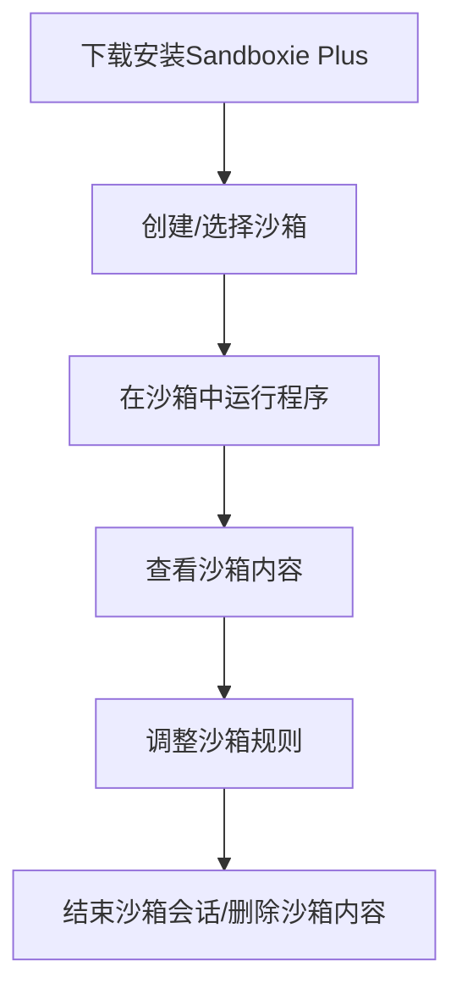
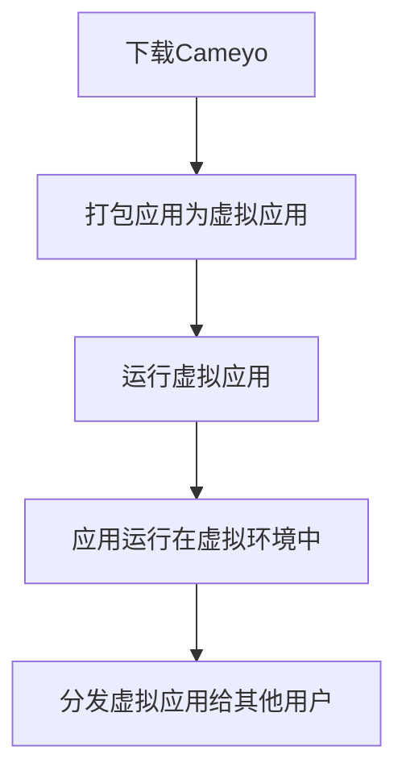
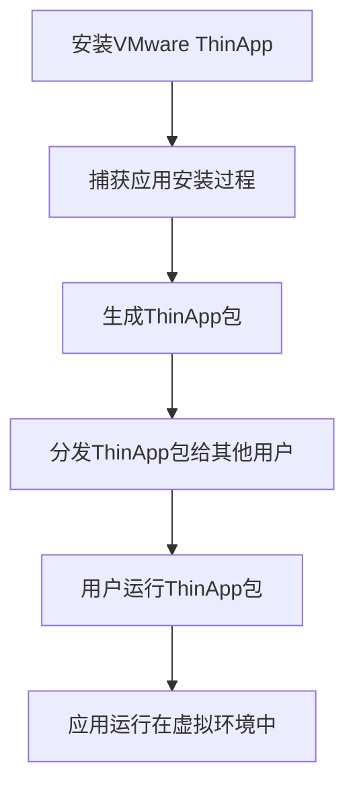
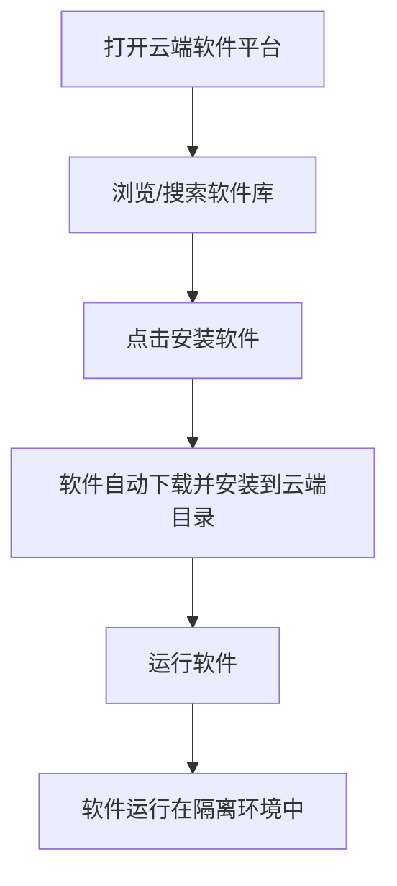
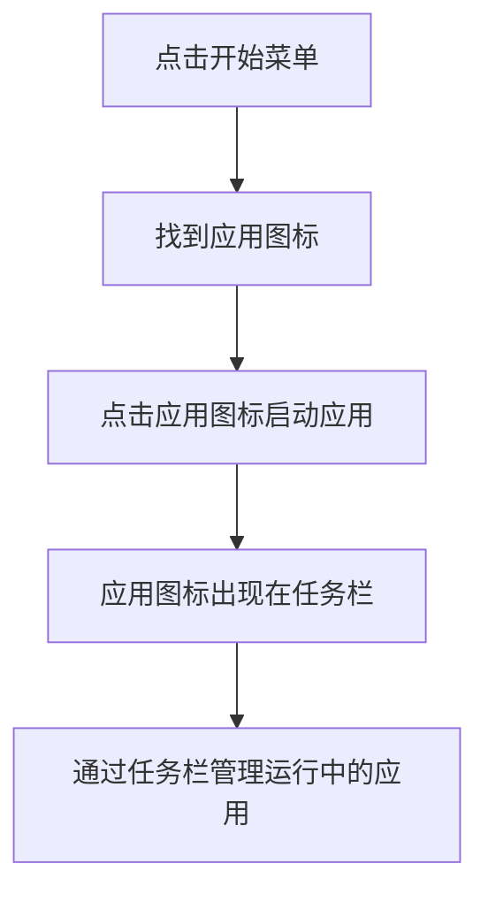

# 交互范式分析报告

## 1. 报告概述
本报告针对AI ThinApp Portable Launchpad Platform项目的竞品进行交互范式研究，分析Sandboxie Plus、Cameyo、VMware ThinApp、云端软件平台、Windows开始菜单/任务栏五个产品的核心交互流程、沙箱/虚拟化概念的呈现方式、优缺点及可借鉴之处，为项目的交互设计提供参考。

---

## 2. 竞品分析

### 2.1 Sandboxie Plus
#### 2.1.1 核心交互流程图（用户旅程）

#### 2.1.2 沙箱/虚拟化概念的呈现方式
- 以“沙箱”为核心管理单元，用户需先理解沙箱概念才能使用
- 运行中的程序会明确标注所属沙箱，沙箱内容通过独立界面查看
- 隔离性通过“沙箱会话”概念传达：程序在沙箱内的改动不会影响真实系统

#### 2.1.3 优点和可借鉴之处
- 沙箱隔离性强，规则配置灵活，适合高级用户
- 沙箱内容可视化较好，用户可以清楚看到沙箱内的文件和注册表项
- **借鉴**：沙箱的视觉区分很重要，需让用户直观感知当前程序是否在沙箱内运行

#### 2.1.4 缺点和用户痛点
- 界面偏技术化，新手用户难以理解“沙箱”概念，学习成本高
- 缺乏应用管理功能，仅能管理沙箱，无法统一管理多个应用
- 沙箱规则配置复杂，普通用户难以正确设置

#### 2.1.5 对本项目的启发
- 需简化沙箱概念的传达，避免技术术语，用用户易懂的方式解释“隔离”
- 需提供应用管理功能，而不仅仅是沙箱管理，方便用户统一管理多个便携化应用
- 沙箱规则需提供默认配置，减少用户的配置负担

---

### 2.2 Cameyo
#### 2.2.1 核心交互流程图（用户旅程）

#### 2.2.2 沙箱/虚拟化概念的呈现方式
- 以“虚拟应用”为核心，用户无需理解“沙箱”概念，仅需知道应用“不用安装即可运行”
- 虚拟应用的所有改动都保存在虚拟环境中，用户感知不到明显的隔离边界

#### 2.2.3 优点和可借鉴之处
- 应用便携性强，打包后的虚拟应用可直接运行，无需安装
- 对用户隐藏了复杂的虚拟化技术，降低了使用门槛
- **借鉴**：“便携化”概念的传达需直观，让用户清楚知道应用可以“随处运行，不写系统”

#### 2.2.4 缺点和用户痛点
- 虚拟应用的兼容性较差，部分应用无法正确打包或运行
- 用户无法直观看到虚拟应用内的文件存储位置，管理不便
- 缺乏应用库管理功能，用户难以统一管理多个虚拟应用

#### 2.2.5 对本项目的启发
- 需明确传达“便携化”的概念，让用户知道应用的文件都保存在自身目录内，可随意移动
- 需提供虚拟环境内容的可视化浏览功能，让用户能查看和管理沙箱内的文件
- 需建立应用库管理功能，方便用户统一管理多个便携化应用

---

### 2.3 VMware ThinApp
#### 2.3.1 核心交互流程图（用户旅程）

#### 2.3.2 沙箱/虚拟化概念的呈现方式
- 面向企业用户，以“ThinApp包”为核心，用户无需理解沙箱概念
- 虚拟环境完全透明，用户感知不到隔离的存在，应用运行体验与真实安装一致

#### 2.3.3 优点和可借鉴之处
- 企业级部署方便，ThinApp包可快速分发给大量用户
- 应用兼容性好，能兼容大多数Windows应用
- **借鉴**：如果面向个人用户，需简化打包流程，提供一键打包功能

#### 2.3.4 缺点和用户痛点
- 面向企业用户，普通用户难以使用，需要专业的技术背景
- 缺乏面向个人用户的应用库管理界面，用户难以统一管理多个ThinApp包
- 打包过程复杂，需要捕获应用安装前后的系统状态，耗时较长

#### 2.3.5 对本项目的启发
- 需简化应用打包流程，提供一键打包功能，让普通用户也能轻松创建便携化应用
- 需提供面向个人用户的应用库管理界面，方便用户统一管理多个便携化应用
- 可参考ThinApp的打包原理，确保应用的兼容性好

---

### 2.4 云端软件平台（国内历史产品）
#### 2.4.1 核心交互流程图（用户旅程）

#### 2.4.2 沙箱/虚拟化概念的呈现方式
- 以“软件库”为核心，用户无需理解“沙箱”或“虚拟化”概念
- 软件安装后集中在云端目录，用户知道软件“不写入系统盘”，但不知道具体的隔离机制

#### 2.4.3 优点和可借鉴之处
- 软件库分类清晰，搜索功能强大，用户能快速找到所需软件
- 软件安装方便，一键安装，无需用户手动配置
- **借鉴**：应用库的分类和搜索功能需好用，让用户能快速找到所需应用

#### 2.4.4 缺点和用户痛点
- 产品已停止维护，软件库内容陈旧，许多软件无法下载
- 沙箱概念不明确，用户不知道应用的文件具体存储位置，难以管理
- 界面设计陈旧，不符合现代用户的使用习惯

#### 2.4.5 对本项目的启发
- 需建立分类清晰、搜索方便的应用库（软件商店），让用户能快速找到所需应用
- 需明确传达应用的文件存储位置，让用户能轻松管理应用内的文件
- 界面设计需符合现代用户的使用习惯，简洁易用

---

### 2.5 Windows 开始菜单 / 任务栏
#### 2.5.1 核心交互流程图（用户旅程）

#### 2.5.2 沙箱/虚拟化概念的呈现方式
- 无沙箱或虚拟化相关功能，所有应用都运行在真实系统中
- 交互设计遵循Windows原生规范，用户使用习惯成熟

#### 2.5.3 优点和可借鉴之处
- 用户熟悉交互方式，学习成本低，无需额外学习
- 开始菜单和任务栏的应用管理功能强大，用户能快速启动和管理应用
- **借鉴**：项目的交互设计需尽量符合Windows原生规范，让用户容易上手

#### 2.5.4 缺点和用户痛点
- 无沙箱或虚拟化功能，应用运行时会写入系统盘，难以管理
- 开始菜单和应用列表容易杂乱，难以统一管理所有应用

#### 2.5.5 对本项目的启发
- 项目的交互设计需尽量符合Windows原生规范，比如启动应用的按钮位置、任务栏图标的设计等
- 可提供开始菜单替换功能，让用户能统一管理系统中的所有应用（包括便携化和非便携化应用）

---

## 3. 综合启发与建议
结合以上竞品分析，对本项目的交互设计提出以下建议：
1. **简化概念传达**：避免技术术语，用“便携化”“应用自带隔离空间”等用户易懂的概念解释沙箱功能
2. **符合原生交互习惯**：尽量遵循Windows开始菜单、任务栏的原生交互规范，降低用户学习成本
3. **强化应用库管理**：提供分类清晰、搜索方便的应用库（软件商店），方便用户统一管理多个便携化应用
4. **可视化沙箱内容**：提供沙箱内容浏览器，让用户能直观查看和管理沙箱内的文件与注册表项
5. **简化配置流程**：提供默认配置，减少用户的配置负担，同时保留高级配置选项满足高级用户需求
6. **明确视觉区分**：通过视觉标识（如任务栏角标、窗口边框着色）让用户直观区分沙箱内和沙箱外的应用

---

## 4. 用户心智模型定义
（本部分基于产品规格文档，定义目标用户的心智模型）

### 4.1 用户如何理解“每个软件自带沙箱”？
- 目标用户（Windows个人用户）对“沙箱”概念较为陌生，需将其类比为“每个软件都有自己的独立房间”
- 解释：“每个软件的运行环境都是独立的，软件对系统的改动都保存在自己的目录内，不会影响其他软件和系统”
- 避免直接使用“沙箱”术语，可先用“独立运行空间”“隔离环境”等更易懂的说法，待用户熟悉后再引入“沙箱”概念

### 4.2 “沙箱内/外”的视觉区分方案
- 优先采用“任务栏标识+窗口边框着色”的组合方案：
  - 任务栏标识：沙箱内运行的应用图标加绿色角标（✅），沙箱外运行的应用图标加红色角标（⚠️）
  - 窗口边框着色：沙箱内应用的窗口边框显示为绿色，沙箱外应用的窗口边框显示为默认颜色
- 视觉区分需明显但不突兀，避免影响用户的正常使用

### 4.3 “便携化”概念如何传达？
- 核心信息传递：“把软件装进U盘，到哪里都能用，不留下痕迹”
- 演示方式：在首次使用引导中，让用户将一个应用便携化后，移动到其他目录（或U盘），然后直接运行，让用户直观感受便携化的效果
- 强调优势：“重装系统后，无需重新安装软件，直接复制应用目录即可恢复使用”

### 4.4 新手引导的核心信息传递顺序
1. **欢迎页**：介绍产品核心价值（“让软件便携化，不写系统，随处运行”）
2. **概念介绍**：用简单易懂的语言解释“每个软件自带独立运行空间（沙箱）”
3. **添加第一个应用**：引导用户添加本地已有的应用，或去软件商店下载应用
4. **启动应用并查看效果**：让用户启动应用，然后查看应用的文件都保存在自身目录内，直观感受沙箱的隔离效果
5. **完成引导**：引导用户开始使用，或跳过引导直接进入主界面

---

## 5. 报告总结
本报告通过对五个竞品的交互范式分析，总结了各竞品的优缺点及可借鉴之处，并结合项目目标用户的特点，定义了用户心智模型。后续的交互设计将基于本报告的结论，确保产品易用、符合用户习惯，同时准确传达核心价值。
